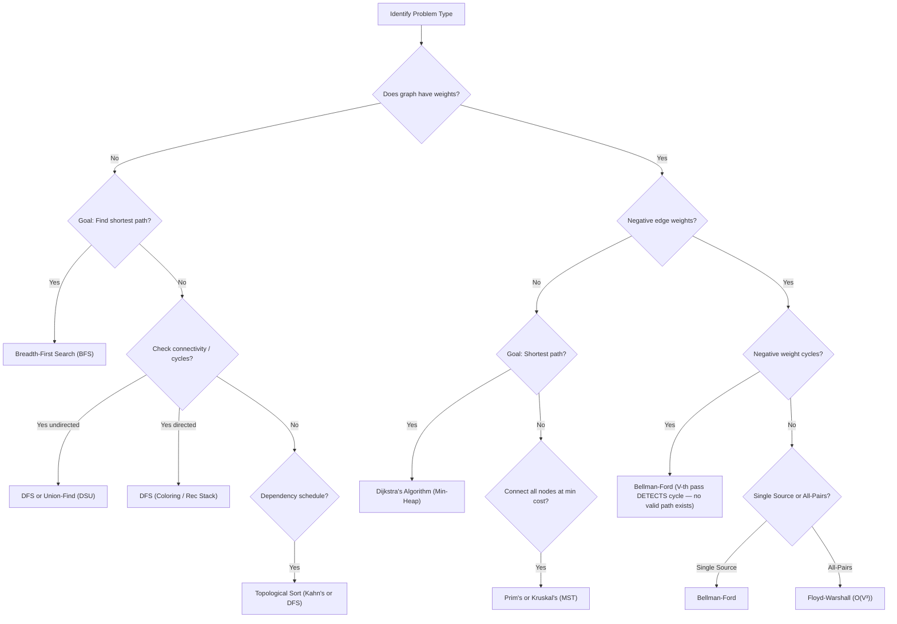

# Mastering Graph Algorithms for FAANG & Top Product Companies
### The Definitive Interview Handbook for Software Engineers
*Complete Theory | Production-Grade Multi-Language Code | 20 High-Yield Solutions | Cheat Sheets*

---

## Table of Contents
1. [Graph Fundamentals & Representations](#1-graph-fundamentals--representations)
2. [Graph Traversal: BFS & DFS](#2-graph-traversal-bfs--dfs)
3. [Cycle Detection Patterns](#3-cycle-detection-patterns)
4. [Topological Sorting (Kahn's & DFS)](#4-topological-sorting-kahns--dfs)
5. [Shortest Path Algorithms (Dijkstra, Bellman-Ford, Floyd-Warshall)](#5-shortest-path-algorithms-dijkstra-bellman-ford-floyd-warshall)
6. [Disjoint Set Union (Union Find)](#6-disjoint-set-union-union-find)
7. [Minimum Spanning Trees (Kruskal & Prim)](#7-minimum-spanning-trees-kruskal--prim)
8. [Strongly Connected Components (Kosaraju & Tarjan)](#8-strongly-connected-components-kosaraju--tarjan)
9. [Bridges and Articulation Points (Tarjan's)](#9-bridges-and-articulation-points-tarjans)
10. [Bipartite Graphs](#10-bipartite-graphs)
11. [Advanced Algorithms (Multi-source BFS, 0-1 BFS, Network Flows)](#11-advanced-algorithms-multi-source-bfs-0-1-bfs-network-flows)
12. [Grid-Based Implicit Graphs](#12-grid-based-implicit-graphs)
13. [Dynamic Programming on DAGs](#13-dynamic-programming-on-dags)
14. [Graph Algorithm Selection Guide & Interview Patterns](#14-graph-algorithm-selection-guide--interview-patterns)
15. [20 High-Yield FAANG Interview Questions](#15-20-high-yield-faang-interview-questions)
16. [Quick-Revision Cheat Sheets](#16-quick-revision-cheat-sheets)

---

## 1. Graph Fundamentals & Representations

In FAANG interviews, graph problems are rarely presented directly as mathematical graphs. Instead, they are disguised as real-world scenarios: scheduling meetings, routing network packets, finding the shortest path out of a maze, evaluating dependencies between software modules, or modeling social network connections.

### Core Concepts

*   **Graph ($G = (V, E)$)**: A collection of Vertices (or nodes) $V$ and Edges $E$ connecting them.
*   **Directed vs. Undirected**:
    *   **Undirected Graph**: Edges are bidirectional. If there is an edge between $u$ and $v$, you can travel in both directions: $(u, v) \equiv (v, u)$.
    *   **Directed Graph (Digraph)**: Edges have a specific direction. An edge $u \to v$ allows travel only from $u$ to $v$.
*   **Weighted vs. Unweighted**:
    *   **Unweighted Graph**: All edges are equal in cost (typically treated as weight = 1).
    *   **Weighted Graph**: Each edge has an associated cost, distance, or capacity.
*   **Cyclic vs. Acyclic**:
    *   **Cyclic Graph**: Contains at least one path that starts and ends at the same vertex.
    *   **Acyclic Graph**: Contains no cycles. A Directed Acyclic Graph is called a **DAG**.

### Graph Representations Complexity Table

| Representation | Space Complexity | Edge Lookup | Edge Insertion | Vertex Insertion | Best Used For |
| :--- | :--- | :--- | :--- | :--- | :--- |
| **Adjacency List** | $O(V + E)$ | $O(\text{degree}(u))$ | $O(1)$ | $O(1)$ | Sparse graphs, DFS/BFS traversals, $95\%$ of interview questions. |
| **Adjacency Matrix** | $O(V^2)$ | $O(1)$ | $O(1)$ | $O(V^2)$ | Dense graphs, checking edge existence instantly, 2D grid/maze matrices. |

---

### Implementation Code

<details>
<summary><strong>Python</strong></summary>

```python
class GraphRepresentations:
    @staticmethod
    def create_adjacency_list(n: int, edges: list[list[int]], bidirectional: bool = True) -> list[list[int]]:
        adj_list = [[] for _ in range(n)]
        for u, v in edges:
            adj_list[u].append(v)
            if bidirectional:
                adj_list[v].append(u)
        return adj_list

    @staticmethod
    def create_adjacency_matrix(n: int, edges: list[list[int]], bidirectional: bool = True) -> list[list[int]]:
        matrix = [[0] * n for _ in range(n)]
        for u, v in edges:
            matrix[u][v] = 1
            if bidirectional:
                matrix[v][u] = 1
        return matrix
```

</details>

<details>
<summary><strong>Java</strong></summary>

```java
import java.util.*;

public class GraphRepresentations {
    public static List<List<Integer>> createAdjacencyList(int n, int[][] edges, boolean bidirectional) {
        List<List<Integer>> adjList = new ArrayList<>();
        for (int i = 0; i < n; i++) {
            adjList.add(new ArrayList<>());
        }
        for (int[] edge : edges) {
            int u = edge[0];
            int v = edge[1];
            adjList.get(u).add(v);
            if (bidirectional) {
                adjList.get(v).add(u);
            }
        }
        return adjList;
    }

    public static int[][] createAdjacencyMatrix(int n, int[][] edges, boolean bidirectional) {
        int[][] matrix = new int[n][n];
        for (int[] edge : edges) {
            int u = edge[0];
            int v = edge[1];
            matrix[u][v] = 1;
            if (bidirectional) {
                matrix[v][u] = 1;
            }
        }
        return matrix;
    }
}
```

</details>

<details>
<summary><strong>C++</strong></summary>

```cpp
#include <vector>
using namespace std;

class GraphRepresentations {
public:
    static vector<vector<int>> createAdjacencyList(int n, const vector<vector<int>>& edges, bool bidirectional = true) {
        vector<vector<int>> adjList(n);
        for (const auto& edge : edges) {
            int u = edge[0];
            int v = edge[1];
            adjList[u].push_back(v);
            if (bidirectional) {
                adjList[v].push_back(u);
            }
        }
        return adjList;
    }

    static vector<vector<int>> createAdjacencyMatrix(int n, const vector<vector<int>>& edges, bool bidirectional = true) {
        vector<vector<int>> matrix(n, vector<int>(n, 0));
        for (const auto& edge : edges) {
            int u = edge[0];
            int v = edge[1];
            matrix[u][v] = 1;
            if (bidirectional) {
                matrix[v][u] = 1;
            }
        }
        return matrix;
    }
};
```

</details>

---

## 2. Graph Traversal: BFS & DFS

Traversals are the foundation of all advanced graph algorithms. Master the difference between level-by-level scanning and deep path exploration.

### Breadth-First Search (BFS)
*   **Intuition**: Explores the graph level-by-level in concentric circles. Perfect for finding the **shortest path in unweighted graphs**.
*   **Data Structure**: FIFO Queue.
*   **Time Complexity**: $O(V + E)$
*   **Space Complexity**: $O(V)$ for queue and visited array.

### Depth-First Search (DFS)
*   **Intuition**: Plunges as deep as possible along each branch before backtracking. Great for path finding, connectivity, topological ordering, and exhaustive search space backtracking.
*   **Data Structure**: Call Stack (Recursive) or LIFO Stack (Iterative).
*   **Time Complexity**: $O(V + E)$
*   **Space Complexity**: $O(V)$ for call stack recursion depth.

---

### Implementation Code

<details>
<summary><strong>Python</strong></summary>

```python
from collections import deque

class Traversals:
    @staticmethod
    def bfs(n: int, adj: list[list[int]], start: int) -> list[int]:
        visited = [False] * n
        queue = deque([start])
        visited[start] = True
        traversal_order = []
        
        while queue:
            curr = queue.popleft()
            traversal_order.append(curr)
            for neighbor in adj[curr]:
                if not visited[neighbor]:
                    visited[neighbor] = True
                    queue.append(neighbor)
        return traversal_order

    @staticmethod
    def dfs_recursive(n: int, adj: list[list[int]], start: int) -> list[int]:
        visited = [False] * n
        traversal_order = []
        
        def _dfs(node: int):
            visited[node] = True
            traversal_order.append(node)
            for neighbor in adj[node]:
                if not visited[neighbor]:
                    _dfs(neighbor)
                    
        _dfs(start)
        return traversal_order

    @staticmethod
    def dfs_iterative(n: int, adj: list[list[int]], start: int) -> list[int]:
        visited = [False] * n
        stack = [start]
        visited[start] = True
        traversal_order = []
        
        while stack:
            curr = stack.pop()
            traversal_order.append(curr)
            # Reversing for consistent order matching recursive DFS
            for neighbor in reversed(adj[curr]):
                if not visited[neighbor]:
                    visited[neighbor] = True
                    stack.append(neighbor)
        return traversal_order
```

</details>

<details>
<summary><strong>Java</strong></summary>

```java
import java.util.*;

public class Traversals {
    public static List<Integer> bfs(int n, List<List<Integer>> adj, int start) {
        boolean[] visited = new boolean[n];
        Queue<Integer> queue = new LinkedList<>();
        List<Integer> order = new ArrayList<>();

        queue.offer(start);
        visited[start] = true;

        while (!queue.isEmpty()) {
            int curr = queue.poll();
            order.add(curr);
            for (int neighbor : adj.get(curr)) {
                if (!visited[neighbor]) {
                    visited[neighbor] = true;
                    queue.offer(neighbor);
                }
            }
        }
        return order;
    }

    public static List<Integer> dfsRecursive(int n, List<List<Integer>> adj, int start) {
        boolean[] visited = new boolean[n];
        List<Integer> order = new ArrayList<>();
        dfsHelper(start, adj, visited, order);
        return order;
    }

    private static void dfsHelper(int node, List<List<Integer>> adj, boolean[] visited, List<Integer> order) {
        visited[node] = true;
        order.add(node);
        for (int neighbor : adj.get(node)) {
            if (!visited[neighbor]) {
                dfsHelper(neighbor, adj, visited, order);
            }
        }
    }

    public static List<Integer> dfsIterative(int n, List<List<Integer>> adj, int start) {
        boolean[] visited = new boolean[n];
        Stack<Integer> stack = new Stack<>();
        List<Integer> order = new ArrayList<>();

        stack.push(start);
        visited[start] = true;

        while (!stack.isEmpty()) {
            int curr = stack.pop();
            order.add(curr);
            List<Integer> neighbors = adj.get(curr);
            // Traverse in reverse order to match recursion order
            for (int i = neighbors.size() - 1; i >= 0; i--) {
                int neighbor = neighbors.get(i);
                if (!visited[neighbor]) {
                    visited[neighbor] = true;
                    stack.push(neighbor);
                }
            }
        }
        return order;
    }
}
```

</details>

<details>
<summary><strong>C++</strong></summary>

```cpp
#include <vector>
#include <queue>
#include <stack>
using namespace std;

class Traversals {
private:
    static void dfsHelper(int node, const vector<vector<int>>& adj, vector<bool>& visited, vector<int>& order) {
        visited[node] = true;
        order.push_back(node);
        for (int neighbor : adj[node]) {
            if (!visited[neighbor]) {
                dfsHelper(neighbor, adj, visited, order);
            }
        }
    }

public:
    static vector<int> bfs(int n, const vector<vector<int>>& adj, int start) {
        vector<bool> visited(n, false);
        queue<int> q;
        vector<int> order;

        q.push(start);
        visited[start] = true;

        while (!q.empty()) {
            int curr = q.front();
            q.pop();
            order.push_back(curr);
            for (int neighbor : adj[curr]) {
                if (!visited[neighbor]) {
                    visited[neighbor] = true;
                    q.push(neighbor);
                }
            }
        }
        return order;
    }

    static vector<int> dfsRecursive(int n, const vector<vector<int>>& adj, int start) {
        vector<bool> visited(n, false);
        vector<int> order;
        dfsHelper(start, adj, visited, order);
        return order;
    }

    static vector<int> dfsIterative(int n, const vector<vector<int>>& adj, int start) {
        vector<bool> visited(n, false);
        stack<int> s;
        vector<int> order;

        s.push(start);
        visited[start] = true;

        while (!s.empty()) {
            int curr = s.top();
            s.pop();
            order.push_back(curr);
            const auto& neighbors = adj[curr];
            for (auto it = neighbors.rbegin(); it != neighbors.rend(); ++it) {
                int neighbor = *it;
                if (!visited[neighbor]) {
                    visited[neighbor] = true;
                    s.push(neighbor);
                }
            }
        }
        return order;
    }
};
```

</details>

---

## 3. Cycle Detection Patterns

Cycle detection is highly tested because templates vary drastically between Undirected and Directed graphs.

### Undirected Graph Cycle Detection
*   **Pattern**: In an undirected graph, if you visit a node that is **already visited** AND it is **not the direct parent** of the current node (from whom you just traversed), then a cycle exists.
*   **Approaches**: DFS, BFS, or Union-Find (DSU).

### Directed Graph Cycle Detection
*   **Pattern**: Visited sets are not enough (since cross-edges don't form cycles in directed settings). You must track nodes currently in the **active recursion stack** (the current path being explored).
*   **Color-Coding States (DFS)**: 
    *   `0 / WHITE`: Unvisited.
    *   `1 / GRAY`: Currently visiting (on the recursion stack). If we see a `GRAY` node during traversal, **a cycle exists** (Back Edge).
    *   `2 / BLACK`: Fully processed (backtracked). Safe.
*   **BFS-Based Cycle Detection (Kahn's)**: If we perform a topological sort and the number of nodes in the sorted output is **less than $V$**, a cycle exists.

---

### Implementation Code

<details>
<summary><strong>Python</strong></summary>

```python
class CycleDetection:
    @staticmethod
    def has_cycle_undirected_dfs(n: int, adj: list[list[int]]) -> bool:
        visited = [False] * n
        
        def _dfs(node: int, parent: int) -> bool:
            visited[node] = True
            for neighbor in adj[node]:
                if not visited[neighbor]:
                    if _dfs(neighbor, node):
                        return True
                elif neighbor != parent:
                    return True
            return False
            
        for i in range(n):
            if not visited[i]:
                if _dfs(i, -1):
                    return True
        return False

    @staticmethod
    def has_cycle_directed_dfs(n: int, adj: list[list[int]]) -> bool:
        # States: 0 = unvisited, 1 = visiting (on recursion stack), 2 = visited & completed
        state = [0] * n
        
        def _dfs(node: int) -> bool:
            state[node] = 1 # Gray state
            for neighbor in adj[node]:
                if state[neighbor] == 1:
                    return True  # Back-edge detected
                if state[neighbor] == 0:
                    if _dfs(neighbor):
                        return True
            state[node] = 2 # Black state
            return False
            
        for i in range(n):
            if state[i] == 0:
                if _dfs(i):
                    return True
        return False
```

</details>

<details>
<summary><strong>Java</strong></summary>

```java
import java.util.*;

public class CycleDetection {
    public static boolean hasCycleUndirectedDFS(int n, List<List<Integer>> adj) {
        boolean[] visited = new boolean[n];
        for (int i = 0; i < n; i++) {
            if (!visited[i]) {
                if (dfsUndirected(i, -1, adj, visited)) {
                    return true;
                }
            }
        }
        return false;
    }

    private static boolean dfsUndirected(int curr, int parent, List<List<Integer>> adj, boolean[] visited) {
        visited[curr] = true;
        for (int neighbor : adj.get(curr)) {
            if (!visited[neighbor]) {
                if (dfsUndirected(neighbor, curr, adj, visited)) return true;
            } else if (neighbor != parent) {
                return true;
            }
        }
        return false;
    }

    public static boolean hasCycleDirectedDFS(int n, List<List<Integer>> adj) {
        int[] state = new int[n]; // 0: White, 1: Gray, 2: Black
        for (int i = 0; i < n; i++) {
            if (state[i] == 0) {
                if (dfsDirected(i, adj, state)) return true;
            }
        }
        return false;
    }

    private static boolean dfsDirected(int curr, List<List<Integer>> adj, int[] state) {
        state[curr] = 1; // Mark active recursion (Gray)
        for (int neighbor : adj.get(curr)) {
            if (state[neighbor] == 1) {
                return true; // Found back-edge (Cycle)
            }
            if (state[neighbor] == 0) {
                if (dfsDirected(neighbor, adj, state)) return true;
            }
        }
        state[curr] = 2; // Mark fully explored (Black)
        return false;
    }
}
```

</details>

<details>
<summary><strong>C++</strong></summary>

```cpp
#include <vector>
using namespace std;

class CycleDetection {
private:
    static bool dfsUndirected(int curr, int parent, const vector<vector<int>>& adj, vector<bool>& visited) {
        visited[curr] = true;
        for (int neighbor : adj[curr]) {
            if (!visited[neighbor]) {
                if (dfsUndirected(neighbor, curr, adj, visited)) return true;
            } else if (neighbor != parent) {
                return true;
            }
        }
        return false;
    }

    static bool dfsDirected(int curr, const vector<vector<int>>& adj, vector<int>& state) {
        state[curr] = 1; // Gray state (Visiting)
        for (int neighbor : adj[curr]) {
            if (state[neighbor] == 1) {
                return true; // Back-edge detected
            }
            if (state[neighbor] == 0) {
                if (dfsDirected(neighbor, adj, state)) return true;
            }
        }
        state[curr] = 2; // Black state (Completed)
        return false;
    }

public:
    static bool hasCycleUndirectedDFS(int n, const vector<vector<int>>& adj) {
        vector<bool> visited(n, false);
        for (int i = 0; i < n; i++) {
            if (!visited[i]) {
                if (dfsUndirected(i, -1, adj, visited)) return true;
            }
        }
        return false;
    }

    static bool hasCycleDirectedDFS(int n, const vector<vector<int>>& adj) {
        vector<int> state(n, 0); // 0: White, 1: Gray, 2: Black
        for (int i = 0; i < n; i++) {
            if (state[i] == 0) {
                if (dfsDirected(i, adj, state)) return true;
            }
        }
        return false;
    }
};
```

</details>

---

## 4. Topological Sorting (Kahn's & DFS)

**Topological Sort** is a linear ordering of vertices in a Directed Acyclic Graph (DAG) such that for every directed edge $u \to v$, vertex $u$ comes before $v$ in the ordering. This is the absolute default algorithm for dependency resolution problems.

### Kahn's Algorithm (BFS-based)
*   **Mechanism**: Uses an **in-degree** array to count incoming edges for each node. Push all nodes with in-degree = 0 into a Queue. Pop nodes from the Queue, add them to the topological order, and decrement the in-degrees of their neighbors. If a neighbor's in-degree drops to 0, push it into the Queue.
*   **Benefit**: Extremely clean, intuitive, and inherently detects cycles (if the generated sort size is less than $V$, a cycle exists).

### DFS-based Topological Sort
*   **Mechanism**: Perform a standard DFS. However, as the recursion unwinds (when backtracking from a node after exploring all its neighbors), push the node onto a Stack. The final sorted order is the reverse of the stack (or pop the stack until empty).
*   **Important**: You *must* add cycle detection (via color state arrays) to handle graphs that might not be valid DAGs.

---

### Implementation Code

<details>
<summary><strong>Python</strong></summary>

```python
from collections import deque

class TopologicalSort:
    @staticmethod
    def kahns_algorithm(n: int, adj: list[list[int]]) -> list[int]:
        indegree = [0] * n
        for u in range(n):
            for v in adj[u]:
                indegree[v] += 1
                
        queue = deque([i for i in range(n) if indegree[i] == 0])
        topo_order = []
        
        while queue:
            curr = queue.popleft()
            topo_order.append(curr)
            for neighbor in adj[curr]:
                indegree[neighbor] -= 1
                if indegree[neighbor] == 0:
                    queue.append(neighbor)
                    
        return topo_order if len(topo_order) == n else [] # Return empty list if cycle exists

    @staticmethod
    def dfs_topological_sort(n: int, adj: list[list[int]]) -> list[int]:
        state = [0] * n # 0=White, 1=Gray, 2=Black
        stack = []
        
        def _dfs(node: int) -> bool:
            state[node] = 1 # Gray
            for neighbor in adj[node]:
                if state[neighbor] == 1:
                    return True # Cycle detected
                if state[neighbor] == 0:
                    if _dfs(neighbor):
                        return True
            state[node] = 2 # Black
            stack.append(node)
            return False
            
        for i in range(n):
            if state[i] == 0:
                if _dfs(i):
                    return [] # Cycle detected, no valid topo sort
                    
        return stack[::-1] # Reverse the stack to get correct ordering
```

</details>

<details>
<summary><strong>Java</strong></summary>

```java
import java.util.*;

public class TopologicalSort {
    public static int[] kahnsAlgorithm(int n, List<List<Integer>> adj) {
        int[] indegree = new int[n];
        for (int u = 0; u < n; u++) {
            for (int neighbor : adj.get(u)) {
                indegree[neighbor]++;
            }
        }

        Queue<Integer> queue = new LinkedList<>();
        for (int i = 0; i < n; i++) {
            if (indegree[i] == 0) {
                queue.offer(i);
            }
        }

        int[] topoOrder = new int[n];
        int index = 0;

        while (!queue.isEmpty()) {
            int curr = queue.poll();
            topoOrder[index++] = curr;
            for (int neighbor : adj.get(curr)) {
                indegree[neighbor]--;
                if (indegree[neighbor] == 0) {
                    queue.offer(neighbor);
                }
            }
        }

        return (index == n) ? topoOrder : new int[0]; // Empty array if cycle exists
    }

    public static int[] dfsTopologicalSort(int n, List<List<Integer>> adj) {
        int[] state = new int[n]; // 0: White, 1: Gray, 2: Black
        Stack<Integer> stack = new Stack<>();
        
        for (int i = 0; i < n; i++) {
            if (state[i] == 0) {
                if (dfsHelper(i, adj, state, stack)) {
                    return new int[0]; // Cycle detected, invalid DAG
                }
            }
        }

        int[] topoOrder = new int[n];
        int index = 0;
        while (!stack.isEmpty()) {
            topoOrder[index++] = stack.pop();
        }
        return topoOrder;
    }

    private static boolean dfsHelper(int curr, List<List<Integer>> adj, int[] state, Stack<Integer> stack) {
        state[curr] = 1;
        for (int neighbor : adj.get(curr)) {
            if (state[neighbor] == 1) return true; // Cycle detected
            if (state[neighbor] == 0) {
                if (dfsHelper(neighbor, adj, state, stack)) return true;
            }
        }
        state[curr] = 2;
        stack.push(curr);
        return false;
    }
}
```

</details>

<details>
<summary><strong>C++</strong></summary>

```cpp
#include <vector>
#include <queue>
#include <stack>
#include <algorithm>
using namespace std;

class TopologicalSort {
private:
    static bool dfsHelper(int curr, const vector<vector<int>>& adj, vector<int>& state, stack<int>& s) {
        state[curr] = 1;
        for (int neighbor : adj[curr]) {
            if (state[neighbor] == 1) return true; // Cycle detected
            if (state[neighbor] == 0) {
                if (dfsHelper(neighbor, adj, state, s)) return true;
            }
        }
        state[curr] = 2;
        s.push(curr);
        return false;
    }

public:
    static vector<int> kahnsAlgorithm(int n, const vector<vector<int>>& adj) {
        vector<int> indegree(n, 0);
        for (int u = 0; u < n; ++u) {
            for (int neighbor : adj[u]) {
                indegree[neighbor]++;
            }
        }

        queue<int> q;
        for (int i = 0; i < n; ++i) {
            if (indegree[i] == 0) q.push(i);
        }

        vector<int> topoOrder;
        while (!q.empty()) {
            int curr = q.front();
            q.pop();
            topoOrder.push_back(curr);
            for (int neighbor : adj[curr]) {
                indegree[neighbor]--;
                if (indegree[neighbor] == 0) q.push(neighbor);
            }
        }

        return (topoOrder.size() == n) ? topoOrder : vector<int>();
    }

    static vector<int> dfsTopologicalSort(int n, const vector<vector<int>>& adj) {
        vector<int> state(n, 0);
        stack<int> s;

        for (int i = 0; i < n; ++i) {
            if (state[i] == 0) {
                if (dfsHelper(i, adj, state, s)) {
                    return vector<int>(); // Cycle detected, return empty
                }
            }
        }

        vector<int> topoOrder;
        while (!s.empty()) {
            topoOrder.push_back(s.top());
            s.pop();
        }
        return topoOrder;
    }
};
```

</details>

---

## 5. Shortest Path Algorithms (Dijkstra, Bellman-Ford, Floyd-Warshall)

Choosing the correct shortest path algorithm requires looking at the graph's properties (weights, size, cycle types).

### Dijkstra's Algorithm (Single Source, Positive Weights)
*   **Intuition**: Greedily extracts the node with the minimum tentative distance using a **Min-Heap (Priority Queue)**. Relaxes all outgoing edges of the current vertex.
*   **Why it fails with Negative Weight Edges**: Dijkstra assumes that once a vertex is popped from the min-heap, its shortest path is finalized. If negative edges exist, a longer route with a massive negative step could actually be cheaper, violating the greedy assumption.
*   **Time Complexity**: $O((V + E) \log V)$ with adjacency list and min-heap.
*   **Space Complexity**: $O(V + E)$

### Bellman-Ford Algorithm (Single Source, Negative Weights & Cycle Detection)
*   **Intuition**: Relaxes all edges in the graph $V-1$ times. On a simple graph with no cycles, the maximum length of any shortest path is $V-1$ edges. If we run relaxation a $V$-th time and any distance still decreases, **a negative weight cycle exists** (costs can theoretically spiral down to $-\infty$).
*   **Time Complexity**: $O(V \times E)$
*   **Space Complexity**: $O(V)$

### Floyd-Warshall Algorithm (All-Pairs Shortest Path)
*   **Intuition**: An elegant Dynamic Programming algorithm. For every pair of vertices $(i, j)$, it checks if passing through an intermediate node $k$ results in a shorter path: $dist[i][j] = \min(dist[i][j], dist[i][k] + dist[k][j])$.
*   **Negative Cycle Detection**: If any diagonal element $dist[i][i] < 0$ after completion, a negative cycle exists.
*   **Time Complexity**: $O(V^3)$
*   **Space Complexity**: $O(V^2)$

---

### Implementation Code

<details>
<summary><strong>Python</strong></summary>

```python
import heapq

class ShortestPath:
    @staticmethod
    def dijkstra(n: int, adj: list[list[tuple[int, int]]], start: int) -> list[float]:
        # adj contains tuples of (neighbor, weight)
        dist = [float('inf')] * n
        dist[start] = 0
        min_heap = [(0, start)] # (distance, node)
        
        while min_heap:
            d, curr = heapq.heappop(min_heap)
            
            # Skip if we already found a shorter path to curr
            if d > dist[curr]:
                continue
                
            for neighbor, weight in adj[curr]:
                if dist[curr] + weight < dist[neighbor]:
                    dist[neighbor] = dist[curr] + weight
                    heapq.heappush(min_heap, (dist[neighbor], neighbor))
                    
        return dist

    @staticmethod
    def bellman_ford(n: int, edges: list[list[int]], start: int) -> tuple[list[float], bool]:
        # edges is a list of [u, v, weight]
        dist = [float('inf')] * n
        dist[start] = 0
        
        # Relax all edges V-1 times
        for _ in range(n - 1):
            for u, v, w in edges:
                if dist[u] != float('inf') and dist[u] + w < dist[v]:
                    dist[v] = dist[u] + w
                    
        # Check for negative weight cycles on V-th pass
        for u, v, w in edges:
            if dist[u] != float('inf') and dist[u] + w < dist[v]:
                return [], True # Negative cycle exists!
                
        return dist, False

    @staticmethod
    def floyd_warshall(n: int, edges: list[list[int]]) -> list[list[float]]:
        # NOTE: This implementation assumes DIRECTED edges.
        # For undirected graphs, also set dist[v][u] = min(dist[v][u], w) for each edge.
        # Initialize distance matrix
        dist = [[float('inf')] * n for _ in range(n)]
        for i in range(n):
            dist[i][i] = 0
        for u, v, w in edges:
            dist[u][v] = min(dist[u][v], w)
            
        for k in range(n):
            for i in range(n):
                for j in range(n):
                    if dist[i][k] != float('inf') and dist[k][j] != float('inf'):
                        dist[i][j] = min(dist[i][j], dist[i][k] + dist[k][j])
                        
        return dist
```

</details>

<details>
<summary><strong>Java</strong></summary>

```java
import java.util.*;

public class ShortestPath {
    public static class Edge {
        int to;
        int weight;
        public Edge(int to, int weight) {
            this.to = to;
            this.weight = weight;
        }
    }

    public static int[] dijkstra(int n, List<List<Edge>> adj, int start) {
        int[] dist = new int[n];
        Arrays.fill(dist, Integer.MAX_VALUE);
        dist[start] = 0;

        PriorityQueue<int[]> minHeap = new PriorityQueue<>(Comparator.comparingInt(a -> a[0]));
        minHeap.offer(new int[]{0, start}); // {distance, node}

        while (!minHeap.isEmpty()) {
            int[] pair = minHeap.poll();
            int d = pair[0];
            int curr = pair[1];

            if (d > dist[curr]) continue;

            for (Edge edge : adj.get(curr)) {
                if (dist[curr] != Integer.MAX_VALUE && dist[curr] + edge.weight < dist[edge.to]) {
                    dist[edge.to] = dist[curr] + edge.weight;
                    minHeap.offer(new int[]{dist[edge.to], edge.to});
                }
            }
        }
        return dist;
    }

    public static int[] bellmanFord(int n, int[][] edges, int start) throws Exception {
        int[] dist = new int[n];
        Arrays.fill(dist, Integer.MAX_VALUE);
        dist[start] = 0;

        for (int i = 0; i < n - 1; i++) {
            for (int[] edge : edges) {
                int u = edge[0];
                int v = edge[1];
                int w = edge[2];
                if (dist[u] != Integer.MAX_VALUE && dist[u] + w < dist[v]) {
                    dist[v] = dist[u] + w;
                }
            }
        }

        // V-th iteration to check for negative cycles
        for (int[] edge : edges) {
            int u = edge[0];
            int v = edge[1];
            int w = edge[2];
            if (dist[u] != Integer.MAX_VALUE && dist[u] + w < dist[v]) {
                throw new Exception("Negative weight cycle detected.");
            }
        }
        return dist;
    }

    public static int[][] floydWarshall(int n, int[][] edges) {
        int[][] dist = new int[n][n];
        for (int i = 0; i < n; i++) {
            Arrays.fill(dist[i], 1000000000); // Using standard big integer to prevent overflow on additions
            dist[i][i] = 0;
        }

        for (int[] edge : edges) {
            int u = edge[0];
            int v = edge[1];
            int w = edge[2];
            dist[u][v] = Math.min(dist[u][v], w);
        }

        for (int k = 0; k < n; k++) {
            for (int i = 0; i < n; i++) {
                for (int j = 0; j < n; j++) {
                    if (dist[i][k] != 1000000000 && dist[k][j] != 1000000000) {
                        dist[i][j] = Math.min(dist[i][j], dist[i][k] + dist[k][j]);
                    }
                }
            }
        }
        return dist;
    }
}
```

</details>

<details>
<summary><strong>C++</strong></summary>

```cpp
#include <vector>
#include <queue>
#include <stdexcept>
#include <algorithm>
using namespace std;

class ShortestPath {
public:
    struct Edge {
        int to;
        int weight;
    };

    static vector<int> dijkstra(int n, const vector<vector<Edge>>& adj, int start) {
        const int INF = 1000000000; // Safe int sentinel (1e9 fits well below INT_MAX)
        vector<int> dist(n, INF);
        dist[start] = 0;
        
        // Min-heap storing {distance, node}
        priority_queue<pair<int, int>, vector<pair<int, int>>, greater<pair<int, int>>> minHeap;
        minHeap.push({0, start});

        while (!minHeap.empty()) {
            auto [d, curr] = minHeap.top();
            minHeap.pop();

            if (d > dist[curr]) continue;

            for (const auto& edge : adj[curr]) {
                // Guard against overflow before adding weight to dist[curr]
                if (dist[curr] != INF && dist[curr] + edge.weight < dist[edge.to]) {
                    dist[edge.to] = dist[curr] + edge.weight;
                    minHeap.push({dist[edge.to], edge.to});
                }
            }
        }
        return dist;
    }

    static vector<int> bellmanFord(int n, const vector<vector<int>>& edges, int start) {
        const int INF = 1000000000;
        vector<int> dist(n, INF);
        dist[start] = 0;

        for (int i = 0; i < n - 1; ++i) {
            for (const auto& edge : edges) {
                int u = edge[0];
                int v = edge[1];
                int w = edge[2];
                if (dist[u] != INF && dist[u] + w < dist[v]) {
                    dist[v] = dist[u] + w;
                }
            }
        }

        // V-th check for negative weight cycles
        for (const auto& edge : edges) {
            int u = edge[0];
            int v = edge[1];
            int w = edge[2];
            if (dist[u] != INF && dist[u] + w < dist[v]) {
                throw runtime_error("Negative weight cycle detected.");
            }
        }
        return dist;
    }

    static vector<vector<int>> floydWarshall(int n, const vector<vector<int>>& edges) {
        // NOTE: Assumes directed edges. For undirected, also set dist[v][u] = min(dist[v][u], w).
        const int INF = 1000000000;
        vector<vector<int>> dist(n, vector<int>(n, INF));
        for (int i = 0; i < n; ++i) dist[i][i] = 0;

        for (const auto& edge : edges) {
            int u = edge[0];
            int v = edge[1];
            int w = edge[2];
            dist[u][v] = min(dist[u][v], w);
        }

        for (int k = 0; k < n; ++k) {
            for (int i = 0; i < n; ++i) {
                for (int j = 0; j < n; ++j) {
                    if (dist[i][k] != INF && dist[k][j] != INF) {
                        dist[i][j] = min(dist[i][j], dist[i][k] + dist[k][j]);
                    }
                }
            }
        }
        return dist;
    }
};
```

</details>

---

## 6. Disjoint Set Union (Union Find)

Disjoint Set Union (DSU) is one of the most powerful data structures for dynamic connectivity, grouping elements, cycle checking, and Kruskal's MST algorithm.

### Key Optimization Principles
*   **Path Compression**: When executing `find(i)`, we dynamically update the parent of all examined nodes directly to the root. This flattens the tree structure, ensuring subsequent queries take amortized $O(1)$ time.
*   **Union by Rank/Size**: Always attach the smaller tree under the root of the larger tree to keep the overall tree height minimized.
*   **Time Complexity**: $O(\alpha(V))$ amortized per operation, where $\alpha$ is the Inverse Ackermann function (behaves as a constant $\le 4$ for all realistic physical values).

---

### Implementation Code

<details>
<summary><strong>Python</strong></summary>

```python
class DisjointSet:
    def __init__(self, n: int):
        self.parent = list(range(n))
        self.rank = [0] * n
        self.size = [1] * n

    def find(self, i: int) -> int:
        if self.parent[i] == i:
            return i
        self.parent[i] = self.find(self.parent[i]) # Path compression
        return self.parent[i]

    def union_by_rank(self, i: int, j: int) -> bool:
        root_i = self.find(i)
        root_j = self.find(j)
        if root_i == root_j:
            return False # Already in same component (cycle detected)
            
        if self.rank[root_i] < self.rank[root_j]:
            self.parent[root_i] = root_j
            self.size[root_j] += self.size[root_i]
        elif self.rank[root_i] > self.rank[root_j]:
            self.parent[root_j] = root_i
            self.size[root_i] += self.size[root_j]
        else:
            self.parent[root_j] = root_i
            self.rank[root_i] += 1
            self.size[root_i] += self.size[root_j]
        return True

    def union_by_size(self, i: int, j: int) -> bool:
        root_i = self.find(i)
        root_j = self.find(j)
        if root_i == root_j:
            return False
            
        if self.size[root_i] < self.size[root_j]:
            self.parent[root_i] = root_j
            self.size[root_j] += self.size[root_i]
        else:
            self.parent[root_j] = root_i
            self.size[root_i] += self.size[root_j]
        return True
        
    def get_size(self, i: int) -> int:
        return self.size[self.find(i)]
```

</details>

<details>
<summary><strong>Java</strong></summary>

```java
public class DisjointSet {
    private final int[] parent;
    private final int[] rank;
    private final int[] size;

    public DisjointSet(int n) {
        parent = new int[n];
        rank = new int[n];
        size = new int[n];
        for (int i = 0; i < n; i++) {
            parent[i] = i;
            size[i] = 1;
        }
    }

    public int find(int i) {
        if (parent[i] == i) {
            return i;
        }
        return parent[i] = find(parent[i]); // Path compression
    }

    public boolean unionByRank(int i, int j) {
        int rootI = find(i);
        int rootJ = find(j);
        if (rootI == rootJ) return false;

        if (rank[rootI] < rank[rootJ]) {
            parent[rootI] = rootJ;
            size[rootJ] += size[rootI];
        } else if (rank[rootI] > rank[rootJ]) {
            parent[rootJ] = rootI;
            size[rootI] += size[rootJ];
        } else {
            parent[rootJ] = rootI;
            rank[rootI]++;
            size[rootI] += size[rootJ];
        }
        return true;
    }

    public boolean unionBySize(int i, int j) {
        int rootI = find(i);
        int rootJ = find(j);
        if (rootI == rootJ) return false;

        if (size[rootI] < size[rootJ]) {
            parent[rootI] = rootJ;
            size[rootJ] += size[rootI];
        } else {
            parent[rootJ] = rootI;
            size[rootI] += size[rootJ];
        }
        return true;
    }

    public int getSize(int i) {
        return size[find(i)];
    }
}
```

</details>

<details>
<summary><strong>C++</strong></summary>

```cpp
#include <vector>
#include <numeric>
using namespace std;

class DisjointSet {
private:
    vector<int> parent;
    vector<int> rank;
    vector<int> size;

public:
    DisjointSet(int n) {
        parent.resize(n);
        iota(parent.begin(), parent.end(), 0);
        rank.resize(n, 0);
        size.resize(n, 1);
    }

    int find(int i) {
        if (parent[i] == i) return i;
        return parent[i] = find(parent[i]); // Path compression
    }

    bool unionByRank(int i, int j) {
        int rootI = find(i);
        int rootJ = find(j);
        if (rootI == rootJ) return false;

        if (rank[rootI] < rank[rootJ]) {
            parent[rootI] = rootJ;
            size[rootJ] += size[rootI];
        } else if (rank[rootI] > rank[rootJ]) {
            parent[rootJ] = rootI;
            size[rootI] += size[rootJ];
        } else {
            parent[rootJ] = rootI;
            rank[rootI]++;
            size[rootI] += size[rootJ];
        }
        return true;
    }

    bool unionBySize(int i, int j) {
        int rootI = find(i);
        int rootJ = find(j);
        if (rootI == rootJ) return false;

        if (size[rootI] < size[rootJ]) {
            parent[rootI] = rootJ;
            size[rootJ] += size[rootI];
        } else {
            parent[rootJ] = rootI;
            size[rootI] += size[rootJ];
        }
        return true;
    }

    int getSize(int i) {
        return size[find(i)];
    }
};
```

</details>

---

## 7. Minimum Spanning Trees (Kruskal & Prim)

A Minimum Spanning Tree (MST) connects all vertices in an undirected, weighted graph with the minimum possible total edge weight, containing exactly $V-1$ edges and no cycles.

### Kruskal's Algorithm (Greedy + DSU)
*   **Intuition**: Focuses on **Edges**. 
    1. Sort all edges in non-decreasing order of weights.
    2. Pick the absolute smallest edge. If it does not form a cycle with our existing MST components (verified instantly using DSU), add it to the MST.
    3. Repeat until exactly $V-1$ edges have been successfully added.
*   **Time Complexity**: $O(E \log E)$ due to sorting edges.
*   **Space Complexity**: $O(V + E)$ for DSU structures and edge listings.

### Prim's Algorithm (Greedy + Min-Heap)
*   **Intuition**: Focuses on **Vertices**.
    1. Start with an arbitrary root vertex (e.g. 0). Mark it visited.
    2. Add all outgoing edges of this vertex into a Min-Priority Queue.
    3. Repeatedly pull the minimum weight edge from the queue. If its target vertex is already visited, discard it. Otherwise, mark the target visited, add the edge's cost to our MST total, and add all outgoing edges of this target node to the priority queue.
    4. Repeat until all vertices have been visited.
*   **Time Complexity**: $O(E \log V)$ using an adjacency list and binary min-heap.
*   **Space Complexity**: $O(V + E)$

---

### Implementation Code

<details>
<summary><strong>Python</strong></summary>

```python
import heapq

class MSTAlgorithms:
    @staticmethod
    def kruskal(n: int, edges: list[list[int]]) -> tuple[int, list[list[int]]]:
        # edges contains elements of format [u, v, weight]
        edges.sort(key=lambda x: x[2]) # Sort by weight
        parent = list(range(n))
        size = [1] * n
        
        def _find(i: int) -> int:
            if parent[i] == i:
                return i
            parent[i] = _find(parent[i])
            return parent[i]
            
        def _union(i: int, j: int) -> bool:
            root_i = _find(i)
            root_j = _find(j)
            if root_i == root_j:
                return False
            # Union by size to keep the tree height minimized
            if size[root_i] < size[root_j]:
                parent[root_i] = root_j
                size[root_j] += size[root_i]
            else:
                parent[root_j] = root_i
                size[root_i] += size[root_j]
            return True
            
        mst_weight = 0
        mst_edges = []
        
        for u, v, w in edges:
            if _union(u, v):
                mst_weight += w
                mst_edges.append([u, v, w])
                if len(mst_edges) == n - 1:
                    break
                    
        return mst_weight, mst_edges

    @staticmethod
    def prim(n: int, adj: list[list[tuple[int, int]]]) -> int:
        # adj contains tuples of (neighbor, weight)
        visited = [False] * n
        min_heap = [(0, 0)] # (weight, node)
        mst_weight = 0
        visited_count = 0
        
        while min_heap and visited_count < n:
            weight, u = heapq.heappop(min_heap)
            if visited[u]:
                continue
                
            visited[u] = True
            mst_weight += weight
            visited_count += 1
            
            for neighbor, w in adj[u]:
                if not visited[neighbor]:
                    heapq.heappush(min_heap, (w, neighbor))
                    
        return mst_weight if visited_count == n else -1
```

</details>

<details>
<summary><strong>Java</strong></summary>

```java
import java.util.*;

public class MSTAlgorithms {
    public static class Edge implements Comparable<Edge> {
        int u, v, w;
        public Edge(int u, int v, int w) {
            this.u = u;
            this.v = v;
            this.w = w;
        }
        @Override
        public int compareTo(Edge other) {
            return Integer.compare(this.w, other.w);
        }
    }

    public static int kruskal(int n, List<Edge> edges) {
        Collections.sort(edges);
        int[] parent = new int[n];
        int[] size = new int[n];
        for (int i = 0; i < n; i++) {
            parent[i] = i;
            size[i] = 1;
        }

        int mstWeight = 0;
        int edgeCount = 0;

        for (Edge edge : edges) {
            int rootU = find(edge.u, parent);
            int rootV = find(edge.v, parent);
            if (rootU != rootV) {
                // Union by size to keep the tree height minimized
                if (size[rootU] < size[rootV]) {
                    parent[rootU] = rootV;
                    size[rootV] += size[rootU];
                } else {
                    parent[rootV] = rootU;
                    size[rootU] += size[rootV];
                }
                mstWeight += edge.w;
                edgeCount++;
                if (edgeCount == n - 1) break;
            }
        }
        return mstWeight;
    }

    private static int find(int i, int[] parent) {
        if (parent[i] == i) return i;
        return parent[i] = find(parent[i], parent);
    }

    public static int prim(int n, List<List<int[]>> adj) {
        boolean[] visited = new boolean[n];
        PriorityQueue<int[]> pq = new PriorityQueue<>(Comparator.comparingInt(a -> a[0])); // {weight, node}
        pq.offer(new int[]{0, 0});

        int mstWeight = 0;
        int visitedCount = 0;

        while (!pq.isEmpty() && visitedCount < n) {
            int[] pair = pq.poll();
            int w = pair[0];
            int u = pair[1];

            if (visited[u]) continue;

            visited[u] = true;
            mstWeight += w;
            visitedCount++;

            for (int[] neighbor : adj.get(u)) {
                int nextNode = neighbor[0];
                int weight = neighbor[1];
                if (!visited[nextNode]) {
                    pq.offer(new int[]{weight, nextNode});
                }
            }
        }
        return (visitedCount == n) ? mstWeight : -1;
    }
}
```

</details>

<details>
<summary><strong>C++</strong></summary>

```cpp
#include <vector>
#include <queue>
#include <algorithm>
using namespace std;

class MSTAlgorithms {
public:
    struct Edge {
        int u, v, w;
        bool operator<(const Edge& other) const {
            return w < other.w;
        }
    };

    static int kruskal(int n, vector<Edge>& edges) {
        sort(edges.begin(), edges.end());
        vector<int> parent(n);
        vector<int> size(n, 1);
        for (int i = 0; i < n; ++i) parent[i] = i;

        auto find = [&](auto& self, int i) -> int {
            if (parent[i] == i) return i;
            return parent[i] = self(self, parent[i]);
        };

        int mstWeight = 0;
        int edgeCount = 0;

        for (const auto& edge : edges) {
            int rootU = find(find, edge.u);
            int rootV = find(find, edge.v);
            if (rootU != rootV) {
                // Union by size to keep the tree height minimized
                if (size[rootU] < size[rootV]) {
                    parent[rootU] = rootV;
                    size[rootV] += size[rootU];
                } else {
                    parent[rootV] = rootU;
                    size[rootU] += size[rootV];
                }
                mstWeight += edge.w;
                edgeCount++;
                if (edgeCount == n - 1) break;
            }
        }
        return mstWeight;
    }

    static int prim(int n, const vector<vector<pair<int, int>>>& adj) {
        vector<bool> visited(n, false);
        // Min-heap storing {weight, node}
        priority_queue<pair<int, int>, vector<pair<int, int>>, greater<pair<int, int>>> pq;
        pq.push({0, 0});

        int mstWeight = 0;
        int visitedCount = 0;

        while (!pq.empty() && visitedCount < n) {
            auto [w, u] = pq.top();
            pq.pop();

            if (visited[u]) continue;

            visited[u] = true;
            mstWeight += w;
            visitedCount++;

            for (const auto& neighbor : adj[u]) {
                int nextNode = neighbor.first;
                int weight = neighbor.second;
                if (!visited[nextNode]) {
                    pq.push({weight, nextNode});
                }
            }
        }
        return (visitedCount == n) ? mstWeight : -1;
    }
};
```

</details>

---

## 8. Strongly Connected Components (Kosaraju & Tarjan)

A Strongly Connected Component (SCC) is a maximal subgraph of a directed graph where every vertex is reachable from every other vertex in the same subgraph.

### Kosaraju's Algorithm (Two-Pass DFS)
*   **Intuition**: Based on the fact that if we transpose (reverse) a directed graph, the SCCs remain exactly the same, but the traversal order between distinct components is inverted.
    1. Perform a standard DFS. As nodes finish (recursion stack pop), push them onto a finishing-time Stack.
    2. Transpose the graph (reverse the direction of all edges).
    3. Process nodes in the order they appear on the Stack. For each unvisited node, trigger a DFS on the transposed graph. Every node reached in this run forms a complete SCC.
*   **Time Complexity**: $O(V + E)$
*   **Space Complexity**: $O(V + E)$

### Tarjan's SCC Algorithm (Single-Pass DFS)
*   **Intuition**: Uses a single DFS to track discovery times (`disc`) and low-link values (`low`). A low-link value `low[u]` represents the smallest discovery time reachable from $u$ through back-edges or stack nodes.
    - If `disc[u] == low[u]` during DFS backtracking, $u$ is the head of an SCC. All nodes on the recursion stack popped up to and including $u$ belong to the same SCC.
*   **Time Complexity**: $O(V + E)$
*   **Space Complexity**: $O(V)$

---

### Implementation Code

<details>
<summary><strong>Python</strong></summary>

```python
class SCCAlgorithms:
    @staticmethod
    def kosaraju(n: int, adj: list[list[int]]) -> list[list[int]]:
        visited = [False] * n
        stack = []
        
        def _fill_order(u: int):
            visited[u] = True
            for v in adj[u]:
                if not visited[v]:
                    _fill_order(v)
            stack.append(u)
            
        for i in range(n):
            if not visited[i]:
                _fill_order(i)
                
        # Transpose graph
        adj_t = [[] for _ in range(n)]
        for u in range(n):
            for v in adj[u]:
                adj_t[v].append(u)
                
        visited = [False] * n
        sccs = []
        
        def _dfs_transpose(u: int, current_scc: list[int]):
            visited[u] = True
            current_scc.append(u)
            for v in adj_t[u]:
                if not visited[v]:
                    _dfs_transpose(v, current_scc)
                    
        while stack:
            curr = stack.pop()
            if not visited[curr]:
                scc = []
                _dfs_transpose(curr, scc)
                sccs.append(scc)
                
        return sccs

    @staticmethod
    def tarjan(n: int, adj: list[list[int]]) -> list[list[int]]:
        disc = [-1] * n
        low = [-1] * n
        in_stack = [False] * n
        stack = []
        time = 0
        sccs = []
        
        def _dfs(u: int):
            nonlocal time
            disc[u] = low[u] = time
            time += 1
            stack.append(u)
            in_stack[u] = True
            
            for v in adj[u]:
                if disc[v] == -1:
                    _dfs(v)
                    low[u] = min(low[u], low[v])
                elif in_stack[v]:
                    low[u] = min(low[u], disc[v])
                    
            if low[u] == disc[u]:
                scc = []
                while True:
                    node = stack.pop()
                    in_stack[node] = False
                    scc.append(node)
                    if node == u:
                        break
                sccs.append(scc)
                
        for i in range(n):
            if disc[i] == -1:
                _dfs(i)
        return sccs
```

</details>

<details>
<summary><strong>Java</strong></summary>

```java
import java.util.*;

public class SCCAlgorithms {
    public static List<List<Integer>> kosaraju(int n, List<List<Integer>> adj) {
        boolean[] visited = new boolean[n];
        Stack<Integer> stack = new Stack<>();
        
        for (int i = 0; i < n; i++) {
            if (!visited[i]) {
                fillOrder(i, adj, visited, stack);
            }
        }

        // Transpose
        List<List<Integer>> adjT = new ArrayList<>();
        for (int i = 0; i < n; i++) adjT.add(new ArrayList<>());
        for (int u = 0; u < n; u++) {
            for (int v : adj.get(u)) {
                adjT.get(v).add(u);
            }
        }

        Arrays.fill(visited, false);
        List<List<Integer>> sccs = new ArrayList<>();
        while (!stack.isEmpty()) {
            int curr = stack.pop();
            if (!visited[curr]) {
                List<Integer> scc = new ArrayList<>();
                dfsTranspose(curr, adjT, visited, scc);
                sccs.add(scc);
            }
        }
        return sccs;
    }

    private static void fillOrder(int u, List<List<Integer>> adj, boolean[] visited, Stack<Integer> stack) {
        visited[u] = true;
        for (int v : adj.get(u)) {
            if (!visited[v]) fillOrder(v, adj, visited, stack);
        }
        stack.push(u);
    }

    private static void dfsTranspose(int u, List<List<Integer>> adjT, boolean[] visited, List<Integer> scc) {
        visited[u] = true;
        scc.add(u);
        for (int v : adjT.get(u)) {
            if (!visited[v]) dfsTranspose(v, adjT, visited, scc);
        }
    }

    // time is passed as int[]{0} so static methods can mutate it
    public static List<List<Integer>> tarjan(int n, List<List<Integer>> adj) {
        int[] disc = new int[n];
        int[] low = new int[n];
        boolean[] inStack = new boolean[n];
        Stack<Integer> stack = new Stack<>();
        List<List<Integer>> sccs = new ArrayList<>();
        Arrays.fill(disc, -1);
        Arrays.fill(low, -1);
        int[] time = {0}; // mutable wrapper so static helper can increment it

        for (int i = 0; i < n; i++) {
            if (disc[i] == -1) {
                tarjanDFS(i, adj, disc, low, inStack, stack, sccs, time);
            }
        }
        return sccs;
    }

    private static void tarjanDFS(int u, List<List<Integer>> adj, int[] disc, int[] low, boolean[] inStack, Stack<Integer> stack, List<List<Integer>> sccs, int[] time) {
        disc[u] = low[u] = time[0]++;
        stack.push(u);
        inStack[u] = true;

        for (int v : adj.get(u)) {
            if (disc[v] == -1) {
                tarjanDFS(v, adj, disc, low, inStack, stack, sccs, time);
                low[u] = Math.min(low[u], low[v]);
            } else if (inStack[v]) {
                low[u] = Math.min(low[u], disc[v]);
            }
        }

        if (low[u] == disc[u]) {
            List<Integer> scc = new ArrayList<>();
            while (true) {
                int node = stack.pop();
                inStack[node] = false;
                scc.add(node);
                if (node == u) break;
            }
            sccs.add(scc);
        }
    }
}
```

</details>

<details>
<summary><strong>C++</strong></summary>

```cpp
#include <vector>
#include <stack>
#include <algorithm>
using namespace std;

class SCCAlgorithms {
private:
    static void fillOrder(int u, const vector<vector<int>>& adj, vector<bool>& visited, stack<int>& s) {
        visited[u] = true;
        for (int v : adj[u]) {
            if (!visited[v]) fillOrder(v, adj, visited, s);
        }
        s.push(u);
    }

    static void dfsTranspose(int u, const vector<vector<int>>& adjT, vector<bool>& visited, vector<int>& scc) {
        visited[u] = true;
        scc.push_back(u);
        for (int v : adjT[u]) {
            if (!visited[v]) dfsTranspose(v, adjT, visited, scc);
        }
    }

    static void tarjanDFS(int u, const vector<vector<int>>& adj, vector<int>& disc, vector<int>& low, 
                         vector<bool>& inStack, stack<int>& s, vector<vector<int>>& sccs, int& time) {
        disc[u] = low[u] = time++;
        s.push(u);
        inStack[u] = true;

        for (int v : adj[u]) {
            if (disc[v] == -1) {
                tarjanDFS(v, adj, disc, low, inStack, s, sccs, time);
                low[u] = min(low[u], low[v]);
            } else if (inStack[v]) {
                low[u] = min(low[u], disc[v]);
            }
        }

        if (low[u] == disc[u]) {
            vector<int> scc;
            while (true) {
                int node = s.top();
                s.pop();
                inStack[node] = false;
                scc.push_back(node);
                if (node == u) break;
            }
            sccs.push_back(scc);
        }
    }

public:
    static vector<vector<int>> kosaraju(int n, const vector<vector<int>>& adj) {
        vector<bool> visited(n, false);
        stack<int> s;

        for (int i = 0; i < n; ++i) {
            if (!visited[i]) fillOrder(i, adj, visited, s);
        }

        vector<vector<int>> adjT(n);
        for (int u = 0; u < n; ++u) {
            for (int v : adj[u]) {
                adjT[v].push_back(u);
            }
        }

        fill(visited.begin(), visited.end(), false);
        vector<vector<int>> sccs;

        while (!s.empty()) {
            int curr = s.top();
            s.pop();
            if (!visited[curr]) {
                vector<int> scc;
                dfsTranspose(curr, adjT, visited, scc);
                sccs.push_back(scc);
            }
        }
        return sccs;
    }

    static vector<vector<int>> tarjan(int n, const vector<vector<int>>& adj) {
        vector<int> disc(n, -1);
        vector<int> low(n, -1);
        vector<bool> inStack(n, false);
        stack<int> s;
        vector<vector<int>> sccs;
        int time = 0;

        for (int i = 0; i < n; ++i) {
            if (disc[i] == -1) {
                tarjanDFS(i, adj, disc, low, inStack, s, sccs, time);
            }
        }
        return sccs;
    }
};
```

</details>

---

## 9. Bridges and Articulation Points (Tarjan's)

Highly optimized networking and routing protocols require understanding single points of failure.

*   **Bridge (Critical Edge)**: An edge in an undirected graph whose removal strictly increases the number of connected components.
*   **Articulation Point (Cut Vertex)**: A vertex in an undirected graph whose removal strictly increases the number of connected components.

### Mathematical Conditions during Tarjan's DFS
By maintaining discovery time `disc[u]` and the lowest discovery time reachable from $u$ (excluding parent edge) called `low[u]`:

*   **Bridge Condition**: For a directed step from $u \to v$ in DFS:
    $$\text{If } \text{low}[v] > \text{disc}[u]$$
    Then edge $(u, v)$ is a **Bridge**. This means $v$ has absolutely no alternative back-paths to $u$ or any ancestors of $u$.
*   **Articulation Point Condition**:
    *   **Case 1 (Non-root node $u$)**: If $u$ is not the DFS root and has a child $v$ such that:
        $$\text{low}[v] \ge \text{disc}[u]$$
        Then $u$ is an **Articulation Point**. (All paths out of $v$ must pass through $u$).
    *   **Case 2 (Root node $u$)**: If $u$ is the start of the DFS traversal and has **$\ge 2$ children** in the DFS spanning tree, $u$ is an **Articulation Point**.

---

### Implementation Code

<details>
<summary><strong>Python</strong></summary>

```python
class TarjanCriticalItems:
    @staticmethod
    def find_bridges(n: int, adj: list[list[int]]) -> list[list[int]]:
        disc = [-1] * n
        low = [-1] * n
        bridges = []
        time = 0
        
        def _dfs(u: int, parent: int):
            nonlocal time
            disc[u] = low[u] = time
            time += 1
            
            for v in adj[u]:
                # NOTE: Skipping parent by node ID (not edge ID) may miss bridges in multigraphs
                # (parallel edges). For multigraphs, track the parent edge index instead.
                if v == parent:
                    continue
                if disc[v] == -1:
                    _dfs(v, u)
                    low[u] = min(low[u], low[v])
                    # Bridge condition
                    if low[v] > disc[u]:
                        bridges.append([u, v])
                else:
                    low[u] = min(low[u], disc[v])
                    
        for i in range(n):
            if disc[i] == -1:
                _dfs(i, -1)
        return bridges

    @staticmethod
    def find_articulation_points(n: int, adj: list[list[int]]) -> list[int]:
        disc = [-1] * n
        low = [-1] * n
        is_ap = [False] * n
        time = 0
        
        def _dfs(u: int, parent: int):
            nonlocal time
            disc[u] = low[u] = time
            time += 1
            children = 0
            
            for v in adj[u]:
                # NOTE: Skipping parent by node ID (not edge ID) may miss APs in multigraphs
                # (parallel edges). For multigraphs, track the parent edge index instead.
                if v == parent:
                    continue
                if disc[v] == -1:
                    children += 1
                    _dfs(v, u)
                    low[u] = min(low[u], low[v])
                    # Articulation Point Condition (Non-root)
                    if parent != -1 and low[v] >= disc[u]:
                        is_ap[u] = True
                else:
                    low[u] = min(low[u], disc[v])
                    
            # Articulation Point Condition (Root node)
            if parent == -1 and children > 1:
                is_ap[u] = True
                
        for i in range(n):
            if disc[i] == -1:
                _dfs(i, -1)
                
        return [i for i in range(n) if is_ap[i]]
```

</details>

<details>
<summary><strong>Java</strong></summary>

```java
import java.util.*;

public class TarjanCriticalItems {
    private int time = 0;

    public List<List<Integer>> findBridges(int n, List<List<Integer>> adj) {
        int[] disc = new int[n];
        int[] low = new int[n];
        List<List<Integer>> bridges = new ArrayList<>();
        Arrays.fill(disc, -1);
        Arrays.fill(low, -1);
        time = 0;

        for (int i = 0; i < n; i++) {
            if (disc[i] == -1) {
                dfsBridges(i, -1, adj, disc, low, bridges);
            }
        }
        return bridges;
    }

    private void dfsBridges(int u, int parent, List<List<Integer>> adj, int[] disc, int[] low, List<List<Integer>> bridges) {
        disc[u] = low[u] = time++;
        for (int v : adj.get(u)) {
            // NOTE: Parent skipped by node ID. For multigraphs (parallel edges), use edge index instead.
            if (v == parent) continue;
            if (disc[v] == -1) {
                dfsBridges(v, u, adj, disc, low, bridges);
                low[u] = Math.min(low[u], low[v]);
                if (low[v] > disc[u]) {
                    bridges.add(Arrays.asList(u, v));
                }
            } else {
                low[u] = Math.min(low[u], disc[v]);
            }
        }
    }

    public List<Integer> findArticulationPoints(int n, List<List<Integer>> adj) {
        int[] disc = new int[n];
        int[] low = new int[n];
        boolean[] isAp = new boolean[n];
        Arrays.fill(disc, -1);
        Arrays.fill(low, -1);
        time = 0;

        for (int i = 0; i < n; i++) {
            if (disc[i] == -1) {
                dfsAP(i, -1, adj, disc, low, isAp);
            }
        }

        List<Integer> apList = new ArrayList<>();
        for (int i = 0; i < n; i++) {
            if (isAp[i]) apList.add(i);
        }
        return apList;
    }

    private void dfsAP(int u, int parent, List<List<Integer>> adj, int[] disc, int[] low, boolean[] isAp) {
        disc[u] = low[u] = time++;
        int children = 0;
        for (int v : adj.get(u)) {
            // NOTE: Parent skipped by node ID. For multigraphs (parallel edges), use edge index instead.
            if (v == parent) continue;
            if (disc[v] == -1) {
                children++;
                dfsAP(v, u, adj, disc, low, isAp);
                low[u] = Math.min(low[u], low[v]);
                if (parent != -1 && low[v] >= disc[u]) {
                    isAp[u] = true;
                }
            } else {
                low[u] = Math.min(low[u], disc[v]);
            }
        }
        if (parent == -1 && children > 1) {
            isAp[u] = true;
        }
    }
}
```

</details>

<details>
<summary><strong>C++</strong></summary>

```cpp
#include <vector>
#include <algorithm>
using namespace std;

class TarjanCriticalItems {
private:
    static void dfsBridges(int u, int parent, const vector<vector<int>>& adj, vector<int>& disc, 
                           vector<int>& low, vector<vector<int>>& bridges, int& time) {
        disc[u] = low[u] = time++;
        for (int v : adj[u]) {
            // NOTE: Parent skipped by node ID. For multigraphs (parallel edges), use edge index instead.
            if (v == parent) continue;
            if (disc[v] == -1) {
                dfsBridges(v, u, adj, disc, low, bridges, time);
                low[u] = min(low[u], low[v]);
                if (low[v] > disc[u]) {
                    bridges.push_back({u, v});
                }
            } else {
                low[u] = min(low[u], disc[v]);
            }
        }
    }

    static void dfsAP(int u, int parent, const vector<vector<int>>& adj, vector<int>& disc, 
                      vector<int>& low, vector<bool>& isAp, int& time) {
        disc[u] = low[u] = time++;
        int children = 0;
        for (int v : adj[u]) {
            // NOTE: Parent skipped by node ID. For multigraphs (parallel edges), use edge index instead.
            if (v == parent) continue;
            if (disc[v] == -1) {
                children++;
                dfsAP(v, u, adj, disc, low, isAp, time);
                low[u] = min(low[u], low[v]);
                if (parent != -1 && low[v] >= disc[u]) {
                    isAp[u] = true;
                }
            } else {
                low[u] = min(low[u], disc[v]);
            }
        }
        if (parent == -1 && children > 1) {
            isAp[u] = true;
        }
    }

public:
    static vector<vector<int>> findBridges(int n, const vector<vector<int>>& adj) {
        vector<int> disc(n, -1);
        vector<int> low(n, -1);
        vector<vector<int>> bridges;
        int time = 0;

        for (int i = 0; i < n; ++i) {
            if (disc[i] == -1) {
                dfsBridges(i, -1, adj, disc, low, bridges, time);
            }
        }
        return bridges;
    }

    static vector<int> findArticulationPoints(int n, const vector<vector<int>>& adj) {
        vector<int> disc(n, -1);
        vector<int> low(n, -1);
        vector<bool> isAp(n, false);
        int time = 0;

        for (int i = 0; i < n; ++i) {
            if (disc[i] == -1) {
                dfsAP(i, -1, adj, disc, low, isAp, time);
            }
        }

        vector<int> apList;
        for (int i = 0; i < n; ++i) {
            if (isAp[i]) apList.push_back(i);
        }
        return apList;
    }
};
```

</details>

---

## 10. Bipartite Graphs

A Bipartite Graph is a graph whose vertices can be split into two disjoint sets, $A$ and $B$, such that every edge connects a vertex in $A$ to a vertex in $B$. Equivalently, a graph is Bipartite **if and only if it contains no odd-length cycles**.

### Bipartite Verification (2-Coloring)
*   **Intuition**: We attempt to color the graph using 2 colors (e.g. `0` and `1`). Color a starting vertex with `0`. All neighbors must then be colored with `1`. Their neighbors must be colored with `0`, and so on.
*   **Check**: If we ever encounter an adjacent vertex that is **already colored with the same color** as the current vertex, the graph cannot be Bipartite.
*   **Time Complexity**: $O(V + E)$
*   **Space Complexity**: $O(V)$

---

### Implementation Code

<details>
<summary><strong>Python</strong></summary>

```python
from collections import deque

class BipartiteVerify:
    @staticmethod
    def is_bipartite_bfs(n: int, adj: list[list[int]]) -> bool:
        color = [-1] * n # -1 means uncolored
        
        for i in range(n):
            if color[i] == -1:
                # BFS starting at node i
                color[i] = 0
                queue = deque([i])
                while queue:
                    curr = queue.popleft()
                    for neighbor in adj[curr]:
                        if color[neighbor] == -1:
                            color[neighbor] = 1 - color[curr] # Color with alternative
                            queue.append(neighbor)
                        elif color[neighbor] == color[curr]:
                            return False # Found odd-cycle/same color
        return True

    @staticmethod
    def is_bipartite_dfs(n: int, adj: list[list[int]]) -> bool:
        color = [-1] * n
        
        def _dfs(u: int, c: int) -> bool:
            color[u] = c
            for v in adj[u]:
                if color[v] == -1:
                    if not _dfs(v, 1 - c):
                        return False
                elif color[v] == c:
                    return False
            return True
            
        for i in range(n):
            if color[i] == -1:
                if not _dfs(i, 0):
                    return False
        return True
```

</details>

<details>
<summary><strong>Java</strong></summary>

```java
import java.util.*;

public class BipartiteVerify {
    public static boolean isBipartiteBFS(int n, List<List<Integer>> adj) {
        int[] color = new int[n];
        Arrays.fill(color, -1);

        for (int i = 0; i < n; i++) {
            if (color[i] == -1) {
                color[i] = 0;
                Queue<Integer> queue = new LinkedList<>();
                queue.offer(i);

                while (!queue.isEmpty()) {
                    int curr = queue.poll();
                    for (int neighbor : adj.get(curr)) {
                        if (color[neighbor] == -1) {
                            color[neighbor] = 1 - color[curr];
                            queue.offer(neighbor);
                        } else if (color[neighbor] == color[curr]) {
                            return false;
                        }
                    }
                }
            }
        }
        return true;
    }

    public static boolean isBipartiteDFS(int n, List<List<Integer>> adj) {
        int[] color = new int[n];
        Arrays.fill(color, -1);

        for (int i = 0; i < n; i++) {
            if (color[i] == -1) {
                if (!dfsHelper(i, 0, adj, color)) {
                    return false;
                }
            }
        }
        return true;
    }

    private static boolean dfsHelper(int u, int c, List<List<Integer>> adj, int[] color) {
        color[u] = c;
        for (int v : adj.get(u)) {
            if (color[v] == -1) {
                if (!dfsHelper(v, 1 - c, adj, color)) return false;
            } else if (color[v] == c) {
                return false;
            }
        }
        return true;
    }
}
```

</details>

<details>
<summary><strong>C++</strong></summary>

```cpp
#include <vector>
#include <queue>
#include <algorithm>
using namespace std;

class BipartiteVerify {
private:
    static bool dfsHelper(int u, int c, const vector<vector<int>>& adj, vector<int>& color) {
        color[u] = c;
        for (int v : adj[u]) {
            if (color[v] == -1) {
                if (!dfsHelper(v, 1 - c, adj, color)) return false;
            } else if (color[v] == c) {
                return false;
            }
        }
        return true;
    }

public:
    static bool isBipartiteBFS(int n, const vector<vector<int>>& adj) {
        vector<int> color(n, -1);
        for (int i = 0; i < n; ++i) {
            if (color[i] == -1) {
                color[i] = 0;
                queue<int> q;
                q.push(i);

                while (!q.empty()) {
                    int curr = q.front();
                    q.pop();
                    for (int neighbor : adj[curr]) {
                        if (color[neighbor] == -1) {
                            color[neighbor] = 1 - color[curr];
                            q.push(neighbor);
                        } else if (color[neighbor] == color[curr]) {
                            return false;
                        }
                    }
                }
            }
        }
        return true;
    }

    static bool isBipartiteDFS(int n, const vector<vector<int>>& adj) {
        vector<int> color(n, -1);
        for (int i = 0; i < n; ++i) {
            if (color[i] == -1) {
                if (!dfsHelper(i, 0, adj, color)) return false;
            }
        }
        return true;
    }
};
```

</details>

---

## 11. Advanced Algorithms (Multi-source BFS, 0-1 BFS, Network Flows)

These specialized algorithms appear in top-tier loops when testing optimization limits.

### Multi-Source BFS
*   **Intuition**: Used when you need to model a simultaneous spread (e.g. Rotten Oranges, Virus Outbreaks, Multiple fire origins). Instead of putting a single starting node in the Queue, **push all starting nodes** into the Queue at step 0, and mark them all visited. The level-order traversal will naturally expand in concentric waves from all sources simultaneously.
*   **Time Complexity**: $O(V + E)$
*   **Space Complexity**: $O(V)$

### 0-1 BFS
*   **Intuition**: Used when edge weights are restricted to only `0` and `1`. Standard Dijkstra ($O(E \log V)$) is redundant here. By using a **Double-Ended Queue (Deque)**, if we relax an edge of weight `0`, we push the neighbor to the **front** of the Deque (to process it immediately at the current level). If the weight is `1`, we push it to the **back**.
*   **Time Complexity**: $O(V + E)$
*   **Space Complexity**: $O(V)$

### Network Flows (Edmonds-Karp / Ford-Fulkerson)
*   **Intuition**: Models a directed network where edges represent pipes with capacity constraints. We find the maximum flow from a `source` to a `sink`.
    - **Ford-Fulkerson**: Greedily finds any augmenting path in the residual graph and pushes flow along it until no more paths exist.
    - **Edmonds-Karp**: An optimization of Ford-Fulkerson that uses BFS to find the shortest path (in terms of number of edges) from source to sink.
*   **Time Complexity**: $O(V \times E^2)$ for Edmonds-Karp.
*   **Space Complexity**: $O(V^2)$ or $O(V + E)$ for adjacency matrix/list representation of the residual graph.

---

### Implementation Code

<details>
<summary><strong>Python</strong></summary>

```python
from collections import deque

class AdvancedAlgorithms:
    @staticmethod
    def multi_source_bfs(grid: list[list[int]]) -> int:
        # standard LeetCode 994 Rotten Oranges implementation template
        rows, cols = len(grid), len(grid[0])
        queue = deque()
        fresh_oranges = 0
        
        # Step 1: Add all sources to queue at time = 0
        for r in range(rows):
            for c in range(cols):
                if grid[r][c] == 2: # Rotten (source)
                    queue.append((r, c, 0))
                elif grid[r][c] == 1: # Fresh
                    fresh_oranges += 1
                    
        if fresh_oranges == 0:
            return 0
            
        minutes = 0
        dirs = [(-1,0), (1,0), (0,-1), (0,1)]
        
        while queue:
            r, c, d = queue.popleft()
            minutes = max(minutes, d)
            for dr, dc in dirs:
                nr, nc = r + dr, c + dc
                if 0 <= nr < rows and 0 <= nc < cols and grid[nr][nc] == 1:
                    grid[nr][nc] = 2
                    fresh_oranges -= 1
                    queue.append((nr, nc, d + 1))
                    
        return minutes if fresh_oranges == 0 else -1

    @staticmethod
    def zero_one_bfs(n: int, adj: list[list[tuple[int, int]]], start: int) -> list[float]:
        # adj contains tuples of (neighbor, weight) where weight is only 0 or 1
        dist = [float('inf')] * n
        dist[start] = 0
        queue = deque([start])
        
        while queue:
            curr = queue.popleft()
            for neighbor, weight in adj[curr]:
                if dist[curr] + weight < dist[neighbor]:
                    dist[neighbor] = dist[curr] + weight
                    if weight == 0:
                        queue.appendleft(neighbor) # process immediately
                    else:
                        queue.append(neighbor) # process later
        return dist

    @staticmethod
    def edmonds_karp(n: int, source: int, sink: int, capacity: list[list[int]]) -> int:
        parent = [-1] * n
        
        def _bfs(residual: list[list[int]], s: int, t: int) -> bool:
            visited = [False] * n
            queue = deque([s])
            visited[s] = True
            while queue:
                u = queue.popleft()
                for v in range(n):
                    if not visited[v] and residual[u][v] > 0:
                        queue.append(v)
                        visited[v] = True
                        parent[v] = u
                        if v == t:
                            return True
            return False
            
        residual = [row[:] for row in capacity]
        max_flow = 0
        
        while _bfs(residual, source, sink):
            # Find minimum residual capacity along augmenting path
            path_flow = float('inf')
            s = sink
            while s != source:
                path_flow = min(path_flow, residual[parent[s]][s])
                s = parent[s]
                
            # Update residual capacities of edges and reverse edges
            v = sink
            while v != source:
                u = parent[v]
                residual[u][v] -= path_flow
                residual[v][u] += path_flow
                v = parent[v]
                
            max_flow += path_flow
            
        return max_flow
```

</details>

<details>
<summary><strong>Java</strong></summary>

```java
import java.util.*;

public class AdvancedAlgorithms {
    public static int multiSourceBFS(int[][] grid) {
        int rows = grid.length;
        int cols = grid[0].length;
        Queue<int[]> queue = new LinkedList<>();
        int freshOranges = 0;

        for (int r = 0; r < rows; r++) {
            for (int c = 0; c < cols; c++) {
                if (grid[r][c] == 2) {
                    queue.offer(new int[]{r, c, 0});
                } else if (grid[r][c] == 1) {
                    freshOranges++;
                }
            }
        }

        if (freshOranges == 0) return 0;

        int minutes = 0;
        int[][] dirs = {{-1, 0}, {1, 0}, {0, -1}, {0, 1}};

        while (!queue.isEmpty()) {
            int[] curr = queue.poll();
            int r = curr[0];
            int c = curr[1];
            int d = curr[2];
            minutes = Math.max(minutes, d);

            for (int[] dir : dirs) {
                int nr = r + dir[0];
                int nc = c + dir[1];
                if (nr >= 0 && nr < rows && nc >= 0 && nc < cols && grid[nr][nc] == 1) {
                    grid[nr][nc] = 2;
                    freshOranges--;
                    queue.offer(new int[]{nr, nc, d + 1});
                }
            }
        }
        return (freshOranges == 0) ? minutes : -1;
    }

    public static int[] zeroOneBFS(int n, List<List<int[]>> adj, int start) {
        int[] dist = new int[n];
        Arrays.fill(dist, Integer.MAX_VALUE);
        dist[start] = 0;

        Deque<Integer> deque = new LinkedList<>();
        deque.offer(start);

        while (!deque.isEmpty()) {
            int curr = deque.pollFirst();
            for (int[] edge : adj.get(curr)) {
                int neighbor = edge[0];
                int weight = edge[1];
                if (dist[curr] + weight < dist[neighbor]) {
                    dist[neighbor] = dist[curr] + weight;
                    if (weight == 0) {
                        deque.offerFirst(neighbor);
                    } else {
                        deque.offerLast(neighbor);
                    }
                }
            }
        }
        return dist;
    }

    public static int edmondsKarp(int n, int source, int sink, int[][] capacity) {
        int[][] residual = new int[n][n];
        for (int i = 0; i < n; i++) {
            System.arraycopy(capacity[i], 0, residual[i], 0, n);
        }

        int[] parent = new int[n];
        int maxFlow = 0;

        while (bfsResidual(n, residual, source, sink, parent)) {
            int pathFlow = Integer.MAX_VALUE;
            for (int v = sink; v != source; v = parent[v]) {
                int u = parent[v];
                pathFlow = Math.min(pathFlow, residual[u][v]);
            }

            for (int v = sink; v != source; v = parent[v]) {
                int u = parent[v];
                residual[u][v] -= pathFlow;
                residual[v][u] += pathFlow;
            }

            maxFlow += pathFlow;
        }
        return maxFlow;
    }

    private static boolean bfsResidual(int n, int[][] residual, int s, int t, int[] parent) {
        boolean[] visited = new boolean[n];
        Queue<Integer> queue = new LinkedList<>();
        queue.offer(s);
        visited[s] = true;
        parent[s] = -1;

        while (!queue.isEmpty()) {
            int u = queue.poll();
            for (int v = 0; v < n; v++) {
                if (!visited[v] && residual[u][v] > 0) {
                    queue.offer(v);
                    visited[v] = true;
                    parent[v] = u;
                    if (v == t) return true;
                }
            }
        }
        return false;
    }
}
```

</details>

<details>
<summary><strong>C++</strong></summary>

```cpp
#include <vector>
#include <queue>
#include <deque>
#include <climits>
#include <algorithm>
using namespace std;

class AdvancedAlgorithms {
public:
    static int multiSourceBFS(vector<vector<int>>& grid) {
        int rows = grid.size();
        int cols = grid[0].size();
        queue<vector<int>> q;
        int freshOranges = 0;

        for (int r = 0; r < rows; ++r) {
            for (int c = 0; c < cols; ++c) {
                if (grid[r][c] == 2) {
                    q.push({r, c, 0});
                } else if (grid[r][c] == 1) {
                    freshOranges++;
                }
            }
        }

        if (freshOranges == 0) return 0;

        int minutes = 0;
        vector<pair<int, int>> dirs = {{-1, 0}, {1, 0}, {0, -1}, {0, 1}};

        while (!q.empty()) {
            auto curr = q.front();
            q.pop();
            int r = curr[0];
            int c = curr[1];
            int d = curr[2];
            minutes = max(minutes, d);

            for (const auto& dir : dirs) {
                int nr = r + dir.first;
                int nc = c + dir.second;
                if (nr >= 0 && nr < rows && nc >= 0 && nc < cols && grid[nr][nc] == 1) {
                    grid[nr][nc] = 2;
                    freshOranges--;
                    q.push({nr, nc, d + 1});
                }
            }
        }
        return (freshOranges == 0) ? minutes : -1;
    }

    static vector<int> zeroOneBFS(int n, const vector<vector<pair<int, int>>>& adj, int start) {
        const int INF = 1000000000;
        vector<int> dist(n, INF);
        dist[start] = 0;
        deque<int> dq;
        dq.push_back(start);

        while (!dq.empty()) {
            int curr = dq.front();
            dq.pop_front();

            for (const auto& edge : adj[curr]) {
                int neighbor = edge.first;
                int weight = edge.second;
                if (dist[curr] + weight < dist[neighbor]) {
                    dist[neighbor] = dist[curr] + weight;
                    if (weight == 0) {
                        dq.push_front(neighbor);
                    } else {
                        dq.push_back(neighbor);
                    }
                }
            }
        }
        return dist;
    }

    static int edmondsKarp(int n, int source, int sink, const vector<vector<int>>& capacity) {
        vector<vector<int>> residual = capacity;
        vector<int> parent(n);
        int maxFlow = 0;

        auto bfs = [&](int s, int t) -> bool {
            vector<bool> visited(n, false);
            queue<int> q;
            q.push(s);
            visited[s] = true;
            parent[s] = -1;

            while (!q.empty()) {
                int u = q.front();
                q.pop();
                for (int v = 0; v < n; ++v) {
                    if (!visited[v] && residual[u][v] > 0) {
                        q.push(v);
                        visited[v] = true;
                        parent[v] = u;
                        if (v == t) return true;
                    }
                }
            }
            return false;
        };

        while (bfs(source, sink)) {
            int pathFlow = INT_MAX; // Safe: min will reduce to the actual bottleneck capacity
            for (int v = sink; v != source; v = parent[v]) {
                int u = parent[v];
                pathFlow = min(pathFlow, residual[u][v]);
            }

            for (int v = sink; v != source; v = parent[v]) {
                int u = parent[v];
                residual[u][v] -= pathFlow;
                residual[v][u] += pathFlow;
            }

            maxFlow += pathFlow;
        }
        return maxFlow;
    }
};
```

</details>

---

## 12. Grid-Based Implicit Graphs

A massive subset of FAANG graph problems are presented as a 2D array (Maze, grid of land and water, chess boards). 

### Key Translation Principles
1.  **Nodes**: Cell indices represented as coordinates `(r, c)`.
2.  **Edges**: Virtual relationships between a cell and its 4-directional or 8-directional neighbors.
3.  **Boundary Checks**: You must guarantee any step is within the grid dimensions `0 <= r < rows` and `0 <= c < cols`.
4.  **Movement Vectors Trick**: Use index mapping offsets to write clean, maintainable neighbor-evaluation loops instead of writing separate `if` clauses for up, down, left, right.

---

### Implementation Code

<details>
<summary><strong>Python</strong></summary>

```python
class GridImplicitGraph:
    @staticmethod
    def get_neighbors_4_dir(r: int, c: int, rows: int, cols: int) -> list[tuple[int, int]]:
        # Directions: Up, Down, Left, Right
        dr = [-1, 1, 0, 0]
        dc = [0, 0, -1, 1]
        
        neighbors = []
        for i in range(4):
            nr, nc = r + dr[i], c + dc[i]
            if 0 <= nr < rows and 0 <= nc < cols:
                neighbors.append((nr, nc))
        return neighbors

    @staticmethod
    def get_neighbors_8_dir(r: int, c: int, rows: int, cols: int) -> list[tuple[int, int]]:
        # 8 directions including diagonals
        dr = [-1, -1, -1, 0, 0, 1, 1, 1]
        dc = [-1, 0, 1, -1, 1, -1, 0, 1]
        
        neighbors = []
        for i in range(8):
            nr, nc = r + dr[i], c + dc[i]
            if 0 <= nr < rows and 0 <= nc < cols:
                neighbors.append((nr, nc))
        return neighbors
```

</details>

<details>
<summary><strong>Java</strong></summary>

```java
import java.util.*;

public class GridImplicitGraph {
    public static List<int[]> getNeighbors4Dir(int r, int c, int rows, int cols) {
        int[] dr = {-1, 1, 0, 0};
        int[] dc = {0, 0, -1, 1};
        List<int[]> neighbors = new ArrayList<>();
        for (int i = 0; i < 4; i++) {
            int nr = r + dr[i];
            int nc = c + dc[i];
            if (nr >= 0 && nr < rows && nc >= 0 && nc < cols) {
                neighbors.add(new int[]{nr, nc});
            }
        }
        return neighbors;
    }

    public static List<int[]> getNeighbors8Dir(int r, int c, int rows, int cols) {
        int[] dr = {-1, -1, -1, 0, 0, 1, 1, 1};
        int[] dc = {-1, 0, 1, -1, 1, -1, 0, 1};
        List<int[]> neighbors = new ArrayList<>();
        for (int i = 0; i < 8; i++) {
            int nr = r + dr[i];
            int nc = c + dc[i];
            if (nr >= 0 && nr < rows && nc >= 0 && nc < cols) {
                neighbors.add(new int[]{nr, nc});
            }
        }
        return neighbors;
    }
}
```

</details>

<details>
<summary><strong>C++</strong></summary>

```cpp
#include <vector>
using namespace std;

class GridImplicitGraph {
public:
    static vector<pair<int, int>> getNeighbors4Dir(int r, int c, int rows, int cols) {
        vector<int> dr = {-1, 1, 0, 0};
        vector<int> dc = {0, 0, -1, 1};
        vector<pair<int, int>> neighbors;
        for (int i = 0; i < 4; ++i) {
            int nr = r + dr[i];
            int nc = c + dc[i];
            if (nr >= 0 && nr < rows && nc >= 0 && nc < cols) {
                neighbors.push_back({nr, nc});
            }
        }
        return neighbors;
    }

    static vector<pair<int, int>> getNeighbors8Dir(int r, int c, int rows, int cols) {
        vector<int> dr = {-1, -1, -1, 0, 0, 1, 1, 1};
        vector<int> dc = {-1, 0, 1, -1, 1, -1, 0, 1};
        vector<pair<int, int>> neighbors;
        for (int i = 0; i < 8; ++i) {
            int nr = r + dr[i];
            int nc = c + dc[i];
            if (nr >= 0 && nr < rows && nc >= 0 && nc < cols) {
                neighbors.push_back({nr, nc});
            }
        }
        return neighbors;
    }
};
```

</details>

---

## 13. Dynamic Programming on DAGs

Directed Acyclic Graphs have a highly specific structural property: nodes can be ordered linearly such that no vertex has incoming edges from subsequent vertices (Topological Order). Because of this lack of cycles, dependencies are perfectly resolved, enabling highly efficient dynamic programming without complex state recursion loops.

### Key Applications
1.  **Longest Path in a DAG**: Initialize `dp` array where `dp[u]` represents the longest path starting or ending at $u$. Iterate through vertices in **Topological Order**:
    $$dp[neighbor] = \max(dp[neighbor], dp[curr] + weight)$$
2.  **Shortest Path in a DAG**: Similar to longest path but initialized to $\infty$, relaxing in topological sequence (much faster than Dijkstra, taking exactly $O(V + E)$).
3.  **Total Paths in a DAG**: Calculate path combinations using simple addition.

---

### Implementation Code

<details>
<summary><strong>Python</strong></summary>

```python
class DAGDynamicProgramming:
    @staticmethod
    def longest_path_in_dag(n: int, adj: list[list[tuple[int, int]]]) -> int:
        # Step 1: Compute Topological Sort (Kahn's or DFS)
        indegree = [0] * n
        for u in range(n):
            for v, w in adj[u]:
                indegree[v] += 1
                
        from collections import deque
        queue = deque([i for i in range(n) if indegree[i] == 0])
        topo_order = []
        
        while queue:
            curr = queue.popleft()
            topo_order.append(curr)
            for neighbor, weight in adj[curr]:
                indegree[neighbor] -= 1
                if indegree[neighbor] == 0:
                    queue.append(neighbor)
                    
        # Step 2: Compute DP state transitions in Topological order
        dp = [0] * n # dp[i] represents longest path ending at node i
        
        for u in topo_order:
            for v, w in adj[u]:
                if dp[u] + w > dp[v]:
                    dp[v] = dp[u] + w
                    
        return max(dp)
```

</details>

<details>
<summary><strong>Java</strong></summary>

```java
import java.util.*;

public class DAGDynamicProgramming {
    public static int longestPathInDAG(int n, List<List<int[]>> adj) {
        int[] indegree = new int[n];
        for (int u = 0; u < n; u++) {
            for (int[] edge : adj.get(u)) {
                indegree[edge[0]]++;
            }
        }

        Queue<Integer> queue = new LinkedList<>();
        for (int i = 0; i < n; i++) {
            if (indegree[i] == 0) queue.offer(i);
        }

        List<Integer> topoOrder = new ArrayList<>();
        while (!queue.isEmpty()) {
            int curr = queue.poll();
            topoOrder.add(curr);
            for (int[] edge : adj.get(curr)) {
                int neighbor = edge[0];
                indegree[neighbor]--;
                if (indegree[neighbor] == 0) {
                    queue.offer(neighbor);
                }
            }
        }

        int[] dp = new int[n];
        int maxPath = 0;

        for (int u : topoOrder) {
            for (int[] edge : adj.get(u)) {
                int v = edge[0];
                int w = edge[1];
                dp[v] = Math.max(dp[v], dp[u] + w);
                maxPath = Math.max(maxPath, dp[v]);
            }
        }
        return maxPath;
    }
}
```

</details>

<details>
<summary><strong>C++</strong></summary>

```cpp
#include <vector>
#include <queue>
#include <algorithm>
using namespace std;

class DAGDynamicProgramming {
public:
    static int longestPathInDAG(int n, const vector<vector<pair<int, int>>>& adj) {
        vector<int> indegree(n, 0);
        for (int u = 0; u < n; ++u) {
            for (const auto& edge : adj[u]) {
                indegree[edge.first]++;
            }
        }

        queue<int> q;
        for (int i = 0; i < n; ++i) {
            if (indegree[i] == 0) q.push(i);
        }

        vector<int> topoOrder;
        while (!q.empty()) {
            int curr = q.front();
            q.pop();
            topoOrder.push_back(curr);
            for (const auto& edge : adj[curr]) {
                int neighbor = edge.first;
                indegree[neighbor]--;
                if (indegree[neighbor] == 0) q.push(neighbor);
            }
        }

        vector<int> dp(n, 0);
        int maxPath = 0;

        for (int u : topoOrder) {
            for (const auto& edge : adj[u]) {
                int v = edge.first;
                int w = edge.second;
                dp[v] = max(dp[v], dp[u] + w);
                maxPath = max(maxPath, dp[v]);
            }
        }
        return maxPath;
    }
};
```

</details>

---

## 14. Graph Algorithm Selection Guide & Interview Patterns

The most critical step in a FAANG interview is the first 5 minutes: mapping the disguised problem description to the exact correct algorithm. Use this decision matrix.

### Graph Algorithm Selection Decision Matrix



> [!WARNING]
> If **negative weight cycles** exist, shortest paths are **undefined** (cost → −∞). Bellman-Ford's V-th relaxation pass **detects** this condition, but it **cannot** produce meaningful distances. No algorithm can solve single-source shortest paths on a graph with reachable negative-weight cycles.

### Keyword & Clue Identifier Table

| Keyword / Clue | Underlying Graph Concept | Immediate Candidate Algorithm |
| :--- | :--- | :--- |
| *"Shortest path / fewest steps in grid or unweighted network"* | Unweighted Shortest Path | **BFS** |
| *"Dependencies, Prerequisites, Order of execution"* | Directed Acyclic Graph (DAG) | **Topological Sort** |
| *"Network connections, single point of network failure"* | Critical structural points | **Tarjan's (Bridges / Articulation)** |
| *"Dynamic connectivity, merge groups, duplicate clusters"* | Set tracking and disjoint sets | **Disjoint Set Union (Union Find)** |
| *"Minimum cost to connect all islands/cities"* | Minimum Spanning Tree | **Kruskal's or Prim's** |
| *"Simultaneous viral spread, multiple source contamination"* | Multi-point parallel level traversal | **Multi-Source BFS** |
| *"Step weights restricted to only 0 and 1"* | Restricted edge weights | **0-1 BFS** |
| *"Max water capacity throughput, pipeline distribution"* | Max Flow / Min Cut | **Edmonds-Karp** |

---

## 15. 20 High-Yield FAANG Interview Questions

This curated section presents fully solved production-grade implementations and step-by-step reasoning for the top 20 graph questions asked in MAANG panels.

---

### 1. Alien Dictionary (Hard)

*   **Problem Link**: LeetCode 269 (Premium)
*   **Description**: You are given a list of strings `words` from an alien language's dictionary, where the strings are sorted lexicographically by the rules of this new language. Return a string of the unique letters in the new alien language in lexicographical order. If no valid order exists, return `""`.
*   **Graph Pattern**: Directed Graph, Topological Sort (DAG dependency resolution).
*   **Algorithmic Approach**:
    1.  **Nodes**: Every unique character across all alien words.
    2.  **Edges**: Compare adjacent words. Find the first mismatching character between `words[i]` and `words[i+1]`. A directed edge exists from `words[i][j] -> words[i+1][j]`.
    3.  **Edge Case**: If `word2` is a prefix of `word1` but shorter (e.g. `["abc", "ab"]`), it is mathematically invalid. Return `""`.
    4.  **Topological Sort**: Run Kahn's Algorithm. If the size of the sorted string is less than the count of unique characters, a cycle exists. Return `""`.

<details>
<summary><strong>Python</strong></summary>

```python
from collections import deque

class SolutionAlienDictionary:
    def alienOrder(self, words: list[str]) -> str:
        # Create adjacency list and in-degree counts
        adj = {c: set() for w in words for c in w}
        indegree = {c: 0 for w in words for c in w}
        
        # Build directed graph
        for i in range(len(words) - 1):
            w1, w2 = words[i], words[i+1]
            min_len = min(len(w1), len(w2))
            # Edge case: w2 is shorter prefix of w1
            if len(w1) > len(w2) and w1.startswith(w2):
                return ""
            for j in range(min_len):
                if w1[j] != w2[j]:
                    if w2[j] not in adj[w1[j]]:
                        adj[w1[j]].add(w2[j])
                        indegree[w2[j]] += 1
                    break
                    
        # BFS Kahn's
        queue = deque([c for c in indegree if indegree[c] == 0])
        result = []
        
        while queue:
            curr = queue.popleft()
            result.append(curr)
            for neighbor in adj[curr]:
                indegree[neighbor] -= 1
                if indegree[neighbor] == 0:
                    queue.append(neighbor)
                    
        return "".join(result) if len(result) == len(indegree) else ""
```

</details>

<details>
<summary><strong>C++</strong></summary>

```cpp
#include <string>
#include <vector>
#include <unordered_map>
#include <unordered_set>
#include <queue>
#include <algorithm>
using namespace std;

class SolutionAlienDictionary {
public:
    string alienOrder(vector<string>& words) {
        unordered_map<char, unordered_set<char>> adj;
        unordered_map<char, int> indegree;
        
        for (const auto& w : words) {
            for (char c : w) {
                adj[c] = unordered_set<char>();
                indegree[c] = 0;
            }
        }
        
        for (size_t i = 0; i < words.size() - 1; ++i) {
            string w1 = words[i], w2 = words[i+1];
            if (w1.size() > w2.size() && w1.compare(0, w2.size(), w2) == 0) {
                return "";
            }
            size_t min_len = min(w1.size(), w2.size());
            for (size_t j = 0; j < min_len; ++j) {
                if (w1[j] != w2[j]) {
                    if (adj[w1[j]].find(w2[j]) == adj[w1[j]].end()) {
                        adj[w1[j]].insert(w2[j]);
                        indegree[w2[j]]++;
                    }
                    break;
                }
            }
        }
        
        queue<char> q;
        for (const auto& pair : indegree) {
            if (pair.second == 0) q.push(pair.first);
        }
        
        string result = "";
        while (!q.empty()) {
            char curr = q.front();
            q.pop();
            result += curr;
            for (char neighbor : adj[curr]) {
                indegree[neighbor]--;
                if (indegree[neighbor] == 0) q.push(neighbor);
            }
        }
        
        return (result.size() == indegree.size()) ? result : "";
    }
};
```

</details>

*   **Time Complexity**: $O(C)$ where $C$ is the total length of all alien words combined.
*   **Space Complexity**: $O(1)$ since alphabet limit is fixed at $26$ letters.

---

### 2. Word Ladder II (Hard)

*   **Problem Link**: LeetCode 126
*   **Description**: Given two words, `beginWord` and `endWord`, and a dictionary `wordList`, return *all the shortest transformation sequences* from `beginWord` to `endWord` such that only one letter is changed at a time.
*   **Graph Pattern**: Unweighted Graph Shortest Paths, BFS + Backtracking (DFS).
*   **Algorithmic Approach**:
    1.  **BFS (Level order)**: Find the shortest distance from `beginWord` to all reachable words. Save each word's shortest step level inside a hash map.
    2.  **Backtracking (DFS)**: Traverse backwards from `endWord` (or forward from `beginWord`) using the level map. Only step into adjacent words whose distance value decreases strictly by exactly $1$. This guarantees that every path generated is of minimum possible length.

<details>
<summary><strong>Python</strong></summary>

```python
from collections import deque, defaultdict

class SolutionWordLadderII:
    def findLadders(self, beginWord: str, endWord: str, wordList: list[str]) -> list[list[str]]:
        word_set = set(wordList)
        if endWord not in word_set:
            return []
            
        # BFS to compute shortest distance level for each word from beginWord
        level_map = {beginWord: 0}
        queue = deque([beginWord])
        
        while queue:
            curr = queue.popleft()
            if curr == endWord:
                break
            for i in range(len(curr)):
                for c in 'abcdefghijklmnopqrstuvwxyz':
                    neighbor = curr[:i] + c + curr[i+1:]
                    if neighbor in word_set and neighbor not in level_map:
                        level_map[neighbor] = level_map[curr] + 1
                        queue.append(neighbor)
                        
        if endWord not in level_map:
            return []
            
        # Backtracking DFS
        results = []
        
        def _backtrack(curr: str, path: list[str]):
            if curr == beginWord:
                results.append(path[::-1])
                return
            for i in range(len(curr)):
                for c in 'abcdefghijklmnopqrstuvwxyz':
                    prev = curr[:i] + c + curr[i+1:]
                    if prev in level_map and level_map[prev] == level_map[curr] - 1:
                        path.append(prev)
                        _backtrack(prev, path)
                        path.pop()
                        
        _backtrack(endWord, [endWord])
        return results
```

</details>

<details>
<summary><strong>C++</strong></summary>

```cpp
#include <string>
#include <vector>
#include <unordered_set>
#include <unordered_map>
#include <queue>
#include <algorithm>
using namespace std;

class SolutionWordLadderII {
private:
    unordered_map<string, int> level_map;
    vector<vector<string>> results;
    string start_word;

    void backtrack(const string& curr, vector<string>& path) {
        if (curr == start_word) {
            vector<string> temp = path;
            reverse(temp.begin(), temp.end());
            results.push_back(temp);
            return;
        }
        int curr_level = level_map[curr];
        string temp_word = curr;
        for (size_t i = 0; i < temp_word.size(); ++i) {
            char original = temp_word[i];
            for (char c = 'a'; c <= 'z'; ++c) {
                temp_word[i] = c;
                if (level_map.find(temp_word) != level_map.end() && level_map[temp_word] == curr_level - 1) {
                    path.push_back(temp_word);
                    backtrack(temp_word, path);
                    path.pop_back();
                }
            }
            temp_word[i] = original;
        }
    }

public:
    vector<vector<string>> findLadders(string beginWord, string endWord, vector<string>& wordList) {
        unordered_set<string> word_set(wordList.begin(), wordList.end());
        if (word_set.find(endWord) == word_set.end()) return {};

        queue<string> q;
        q.push(beginWord);
        level_map[beginWord] = 0;

        while (!q.empty()) {
            string curr = q.front();
            q.pop();
            if (curr == endWord) break;
            
            string next_word = curr;
            for (size_t i = 0; i < next_word.size(); ++i) {
                char original = next_word[i];
                for (char c = 'a'; c <= 'z'; ++c) {
                    next_word[i] = c;
                    if (word_set.find(next_word) != word_set.end() && level_map.find(next_word) == level_map.end()) {
                        level_map[next_word] = level_map[curr] + 1;
                        q.push(next_word);
                    }
                }
                next_word[i] = original;
            }
        }

        if (level_map.find(endWord) == level_map.end()) return {};

        start_word = beginWord;
        vector<string> path = {endWord};
        backtrack(endWord, path);
        return results;
    }
};
```

</details>

*   **Time Complexity**: $O(N \cdot 26^L)$ where $N$ is size of `wordList` and $L$ is word length.
*   **Space Complexity**: $O(N \cdot L)$

---

### 3. Course Schedule II (Medium)

*   **Problem Link**: LeetCode 210
*   **Description**: There are a total of `numCourses` courses you have to take, labeled from `0` to `numCourses - 1`. You are given an array `prerequisites` where `prerequisites[i] = [a, b]` indicates that you must take course `b` first if you want to take course `a`. Return *the ordering of courses you should take to finish all courses*. If it is impossible, return *an empty array*.
*   **Graph Pattern**: Directed Graph, Topological Sort (Kahn's).
*   **Algorithmic Approach**: Refer directly to [Topological Sorting Section](#4-topological-sorting-kahns--dfs).

<details>
<summary><strong>Python</strong></summary>

```python
from collections import deque

class SolutionCourseScheduleII:
    def findOrder(self, numCourses: int, prerequisites: list[list[int]]) -> list[int]:
        adj = [[] for _ in range(numCourses)]
        indegree = [0] * numCourses
        
        for dest, src in prerequisites:
            adj[src].append(dest)
            indegree[dest] += 1
            
        queue = deque([i for i in range(numCourses) if indegree[i] == 0])
        order = []
        
        while queue:
            curr = queue.popleft()
            order.append(curr)
            for neighbor in adj[curr]:
                indegree[neighbor] -= 1
                if indegree[neighbor] == 0:
                    queue.append(neighbor)
                    
        return order if len(order) == numCourses else []
```

</details>

<details>
<summary><strong>C++</strong></summary>

```cpp
#include <vector>
#include <queue>
using namespace std;

class SolutionCourseScheduleII {
public:
    vector<int> findOrder(int numCourses, vector<vector<int>>& prerequisites) {
        vector<vector<int>> adj(numCourses);
        vector<int> indegree(numCourses, 0);
        
        for (const auto& pre : prerequisites) {
            int dest = pre[0];
            int src = pre[1];
            adj[src].push_back(dest);
            indegree[dest]++;
        }
        
        queue<int> q;
        for (int i = 0; i < numCourses; ++i) {
            if (indegree[i] == 0) q.push(i);
        }
        
        vector<int> order;
        while (!q.empty()) {
            int curr = q.front();
            q.pop();
            order.push_back(curr);
            for (int neighbor : adj[curr]) {
                indegree[neighbor]--;
                if (indegree[neighbor] == 0) q.push(neighbor);
            }
        }
        
        return (order.size() == numCourses) ? order : vector<int>();
    }
};
```

</details>

*   **Time Complexity**: $O(V + E)$ where $V = \text{numCourses}$, $E = \text{prerequisites.length}$.
*   **Space Complexity**: $O(V + E)$

---

### 4. Number of Islands (Medium)

*   **Problem Link**: LeetCode 200
*   **Description**: Given an `m x n` 2D binary grid `grid` which represents a map of `'1'`s (land) and `'0'`s (water), return *the number of islands*. An island is surrounded by water and is formed by connecting adjacent lands horizontally or vertically.
*   **Graph Pattern**: Grid Implicit Graph, DFS / BFS Connected Components.
*   **Algorithmic Approach**:
    1.  Scan the grid. When you hit a `'1'`, increment your island counter.
    2.  Trigger a DFS or BFS from that cell to find all connected land components. 
    3.  **Sink Technique**: To save auxiliary memory space, flip visited `'1'`s to `'0'`s on the fly during traversal rather than maintaining a separate `visited` array.

<details>
<summary><strong>Python</strong></summary>

```python
class SolutionNumberOfIslands:
    def numIslands(self, grid: list[list[str]]) -> int:
        if not grid:
            return 0
        rows, cols = len(grid), len(grid[0])
        island_count = 0
        
        def _dfs(r: int, c: int):
            grid[r][c] = '0' # Sink visited land
            for dr, dc in [(-1,0), (1,0), (0,-1), (0,1)]:
                nr, nc = r + dr, c + dc
                if 0 <= nr < rows and 0 <= nc < cols and grid[nr][nc] == '1':
                    _dfs(nr, nc)
                    
        for r in range(rows):
            for c in range(cols):
                if grid[r][c] == '1':
                    island_count += 1
                    _dfs(r, c)
                    
        return island_count
```

</details>

<details>
<summary><strong>C++</strong></summary>

```cpp
#include <vector>
using namespace std;

class SolutionNumberOfIslands {
private:
    void dfs(int r, int c, vector<vector<char>>& grid, int rows, int cols) {
        grid[r][c] = '0';
        vector<int> dr = {-1, 1, 0, 0};
        vector<int> dc = {0, 0, -1, 1};
        for (int i = 0; i < 4; ++i) {
            int nr = r + dr[i];
            int nc = c + dc[i];
            if (nr >= 0 && nr < rows && nc >= 0 && nc < cols && grid[nr][nc] == '1') {
                dfs(nr, nc, grid, rows, cols);
            }
        }
    }

public:
    int numIslands(vector<vector<char>>& grid) {
        if (grid.empty()) return 0;
        int rows = grid.size();
        int cols = grid[0].size();
        int island_count = 0;

        for (int r = 0; r < rows; ++r) {
            for (int c = 0; c < cols; ++c) {
                if (grid[r][c] == '1') {
                    island_count++;
                    dfs(r, c, grid, rows, cols);
                }
            }
        }
        return island_count;
    }
};
```

</details>

*   **Time Complexity**: $O(M \times N)$ where $M$ is row count and $N$ is column count.
*   **Space Complexity**: $O(M \times N)$ recursive call stack depth in the worst case (e.g. grid is all land).

---

### 5. Critical Connections in a Network (Hard)

*   **Problem Link**: LeetCode 1192
*   **Description**: Find all critical connections (bridges) in an undirected, connected network of servers.
*   **Graph Pattern**: Undirected Graph, Tarjan's Bridge Detection.
*   **Algorithmic Approach**: Refer directly to [Bridges & Articulation Points Section](#9-bridges-and-articulation-points-tarjans).

<details>
<summary><strong>Python</strong></summary>

```python
class SolutionCriticalConnections:
    def criticalConnections(self, n: int, connections: list[list[int]]) -> list[list[int]]:
        adj = [[] for _ in range(n)]
        for u, v in connections:
            adj[u].append(v)
            adj[v].append(u)
            
        disc = [-1] * n
        low = [-1] * n
        bridges = []
        time = 0
        
        def _dfs(u: int, parent: int):
            nonlocal time
            disc[u] = low[u] = time
            time += 1
            
            for v in adj[u]:
                if v == parent:
                    continue
                if disc[v] == -1:
                    _dfs(v, u)
                    low[u] = min(low[u], low[v])
                    if low[v] > disc[u]:
                        bridges.append([u, v])
                else:
                    low[u] = min(low[u], disc[v])
                    
        _dfs(0, -1)
        return bridges
```

</details>

<details>
<summary><strong>C++</strong></summary>

```cpp
#include <vector>
#include <algorithm>
using namespace std;

class SolutionCriticalConnections {
private:
    int time = 0;
    void dfs(int u, int parent, const vector<vector<int>>& adj, vector<int>& disc, 
             vector<int>& low, vector<vector<int>>& bridges) {
        disc[u] = low[u] = time++;
        for (int v : adj[u]) {
            if (v == parent) continue;
            if (disc[v] == -1) {
                dfs(v, u, adj, disc, low, bridges);
                low[u] = min(low[u], low[v]);
                if (low[v] > disc[u]) {
                    bridges.push_back({u, v});
                }
            } else {
                low[u] = min(low[u], disc[v]);
            }
        }
    }

public:
    vector<vector<int>> criticalConnections(int n, vector<vector<int>>& connections) {
        vector<vector<int>> adj(n);
        for (const auto& conn : connections) {
            adj[conn[0]].push_back(conn[1]);
            adj[conn[1]].push_back(conn[0]);
        }

        vector<int> disc(n, -1);
        vector<int> low(n, -1);
        vector<vector<int>> bridges;
        time = 0;

        dfs(0, -1, adj, disc, low, bridges);
        return bridges;
    }
};
```

</details>

*   **Time Complexity**: $O(V + E)$ where $V = n$, $E = \text{connections.length}$.
*   **Space Complexity**: $O(V + E)$

---

### 6. Rotting Oranges (Medium)

*   **Problem Link**: LeetCode 994
*   **Description**: You are given an `m x n` `grid` where each cell can have one of three values: `0` empty, `1` fresh orange, `2` rotten orange. Every minute, any fresh orange adjacent to a rotten orange becomes rotten. Return *the minimum minutes that must elapse until no cell has a fresh orange*. If impossible, return `-1`.
*   **Graph Pattern**: Grid Implicit, Multi-Source BFS.
*   **Algorithmic Approach**: Refer directly to [Advanced Algorithms Section](#11-advanced-algorithms-multi-source-bfs-0-1-bfs-network-flows).

<details>
<summary><strong>Python</strong></summary>

```python
from collections import deque

class SolutionRottingOranges:
    def orangesRotting(self, grid: list[list[int]]) -> int:
        rows, cols = len(grid), len(grid[0])
        queue = deque()
        fresh = 0
        
        for r in range(rows):
            for c in range(cols):
                if grid[r][c] == 2:
                    queue.append((r, c, 0))
                elif grid[r][c] == 1:
                    fresh += 1
                    
        if fresh == 0:
            return 0
            
        minutes = 0
        while queue:
            r, c, time = queue.popleft()
            minutes = max(minutes, time)
            for dr, dc in [(-1,0), (1,0), (0,-1), (0,1)]:
                nr, nc = r + dr, c + dc
                if 0 <= nr < rows and 0 <= nc < cols and grid[nr][nc] == 1:
                    grid[nr][nc] = 2
                    fresh -= 1
                    queue.append((nr, nc, time + 1))
                    
        return minutes if fresh == 0 else -1
```

</details>

<details>
<summary><strong>C++</strong></summary>

```cpp
#include <vector>
#include <queue>
#include <algorithm>
using namespace std;

class SolutionRottingOranges {
public:
    int orangesRotting(vector<vector<int>>& grid) {
        int rows = grid.size();
        int cols = grid[0].size();
        queue<vector<int>> q;
        int fresh = 0;

        for (int r = 0; r < rows; ++r) {
            for (int c = 0; c < cols; ++c) {
                if (grid[r][c] == 2) {
                    q.push({r, c, 0});
                } else if (grid[r][c] == 1) {
                    fresh++;
                }
            }
        }

        if (fresh == 0) return 0;

        int minutes = 0;
        vector<pair<int, int>> dirs = {{-1, 0}, {1, 0}, {0, -1}, {0, 1}};

        while (!q.empty()) {
            auto curr = q.front();
            q.pop();
            int r = curr[0];
            int c = curr[1];
            int d = curr[2];
            minutes = max(minutes, d);

            for (const auto& dir : dirs) {
                int nr = r + dir.first;
                int nc = c + dir.second;
                if (nr >= 0 && nr < rows && nc >= 0 && nc < cols && grid[nr][nc] == 1) {
                    grid[nr][nc] = 2;
                    fresh--;
                    q.push({nr, nc, d + 1});
                }
            }
        }
        return (fresh == 0) ? minutes : -1;
    }
};
```

</details>

*   **Time Complexity**: $O(M \times N)$
*   **Space Complexity**: $O(M \times N)$

---

### 7. Pacific Atlantic Water Flow (Medium)

*   **Problem Link**: LeetCode 417
*   **Description**: Find the grid coordinates where rainwater can flow down to both the Pacific Ocean (top/left) and Atlantic Ocean (bottom/right). Water can only flow to adjacent cells with equal or lower height.
*   **Graph Pattern**: Boundary-Driven DFS / BFS.
*   **Algorithmic Approach**:
    1.  Instead of checking where water flows *down* from every single cell (slow $O(M^2 N^2)$), perform the traversal in reverse.
    2.  Trace where water can flow *upward* (or flat) starting from the ocean boundaries.
    3.  Run DFS/BFS from all Pacific edge cells. Mark reached nodes in a `pacific_reachable` matrix.
    4.  Run DFS/BFS from all Atlantic edge cells. Mark reached nodes in a `atlantic_reachable` matrix.
    5.  Collect all grid cells that are marked `True` in both ocean reachability matrices.

<details>
<summary><strong>Python</strong></summary>

```python
class SolutionPacificAtlantic:
    def pacificAtlantic(self, heights: list[list[int]]) -> list[list[int]]:
        if not heights:
            return []
        rows, cols = len(heights), len(heights[0])
        pac = [[False] * cols for _ in range(rows)]
        atl = [[False] * cols for _ in range(rows)]
        
        def _dfs(r: int, c: int, reachable: list[list[bool]]):
            reachable[r][c] = True
            for dr, dc in [(-1,0), (1,0), (0,-1), (0,1)]:
                nr, nc = r + dr, c + dc
                if 0 <= nr < rows and 0 <= nc < cols and not reachable[nr][nc]:
                    # Water flows upward/flat in reverse tracking
                    if heights[nr][nc] >= heights[r][c]:
                        _dfs(nr, nc, reachable)
                        
        # Step 1: Run DFS from boundaries
        for r in range(rows):
            _dfs(r, 0, pac)          # Left edge (Pacific)
            _dfs(r, cols - 1, atl)   # Right edge (Atlantic)
        for c in range(cols):
            _dfs(0, c, pac)          # Top edge (Pacific)
            _dfs(rows - 1, c, atl)   # Bottom edge (Atlantic)
            
        # Step 2: Intersection
        return [[r, c] for r in range(rows) for c in range(cols) if pac[r][c] and atl[r][c]]
```

</details>

<details>
<summary><strong>C++</strong></summary>

```cpp
#include <vector>
using namespace std;

class SolutionPacificAtlantic {
private:
    void dfs(int r, int c, const vector<vector<int>>& heights, vector<vector<bool>>& reachable, int rows, int cols) {
        reachable[r][c] = true;
        vector<int> dr = {-1, 1, 0, 0};
        vector<int> dc = {0, 0, -1, 1};
        for (int i = 0; i < 4; ++i) {
            int nr = r + dr[i];
            int nc = c + dc[i];
            if (nr >= 0 && nr < rows && nc >= 0 && nc < cols && !reachable[nr][nc]) {
                if (heights[nr][nc] >= heights[r][c]) {
                    dfs(nr, nc, heights, reachable, rows, cols);
                }
            }
        }
    }

public:
    vector<vector<int>> pacificAtlantic(vector<vector<int>>& heights) {
        if (heights.empty()) return {};
        int rows = heights.size();
        int cols = heights[0].size();
        vector<vector<bool>> pac(rows, vector<bool>(cols, false));
        vector<vector<bool>> atl(rows, vector<bool>(cols, false));

        for (int r = 0; r < rows; ++r) {
            dfs(r, 0, heights, pac, rows, cols);
            dfs(r, cols - 1, heights, atl, rows, cols);
        }
        for (int c = 0; c < cols; ++c) {
            dfs(0, c, heights, pac, rows, cols);
            dfs(rows - 1, c, heights, atl, rows, cols);
        }

        vector<vector<int>> result;
        for (int r = 0; r < rows; ++r) {
            for (int c = 0; c < cols; ++c) {
                if (pac[r][c] && atl[r][c]) {
                    result.push_back({r, c});
                }
            }
        }
        return result;
    }
};
```

</details>

*   **Time Complexity**: $O(M \times N)$
*   **Space Complexity**: $O(M \times N)$

---

### 8. Bus Routes (Hard)

*   **Problem Link**: LeetCode 815
*   **Description**: You are given an array `routes` representing bus routes where `routes[i]` is a loop. You want to travel from `source` to `target`. Return *the least number of buses you must take to travel from source to target*. If impossible, return `-1`.
*   **Graph Pattern**: State Compression, Queue-based BFS (Shortest Path on Custom Nodes).
*   **Algorithmic Approach**:
    1.  **Crucial Insight**: Standard BFS treating *stops* as nodes is too slow. Instead, treat **bus routes** as nodes!
    2.  Map each individual `stop -> list of bus routes` that pass through it.
    3.  Initialize a BFS queue storing `(bus_stop, buses_taken)`.
    4.  Keep a `visited_stops` set and a `visited_routes` set to avoid infinite transfer loops.
    5.  For each stop, check all unvisited bus routes passing through it. Load all stops on those routes into the queue.

<details>
<summary><strong>Python</strong></summary>

```python
from collections import deque, defaultdict

class SolutionBusRoutes:
    def numBusesToDestination(self, routes: list[list[int]], source: int, target: int) -> int:
        if source == target:
            return 0
            
        # Map: stop -> list of route indices
        stop_to_routes = defaultdict(list)
        for route_idx, route in enumerate(routes):
            for stop in route:
                stop_to_routes[stop].append(route_idx)
                
        queue = deque([(source, 0)]) # (stop, count)
        visited_stops = {source}
        visited_routes = set()
        
        while queue:
            curr_stop, bus_count = queue.popleft()
            if curr_stop == target:
                return bus_count
                
            for route_idx in stop_to_routes[curr_stop]:
                if route_idx not in visited_routes:
                    visited_routes.add(route_idx)
                    for next_stop in routes[route_idx]:
                        if next_stop not in visited_stops:
                            visited_stops.add(next_stop)
                            queue.append((next_stop, bus_count + 1))
                            
        return -1
```

</details>

<details>
<summary><strong>C++</strong></summary>

```cpp
#include <vector>
#include <unordered_map>
#include <unordered_set>
#include <queue>
using namespace std;

class SolutionBusRoutes {
public:
    int numBusesToDestination(vector<vector<int>>& routes, int source, int target) {
        if (source == target) return 0;

        unordered_map<int, vector<int>> stop_to_routes;
        for (int i = 0; i < routes.size(); ++i) {
            for (int stop : routes[i]) {
                stop_to_routes[stop].push_back(i);
            }
        }

        queue<pair<int, int>> q; // {stop, count}
        q.push({source, 0});
        unordered_set<int> visited_stops = {source};
        unordered_set<int> visited_routes;

        while (!q.empty()) {
            auto [curr_stop, bus_count] = q.front();
            q.pop();

            if (curr_stop == target) return bus_count;

            for (int route_idx : stop_to_routes[curr_stop]) {
                if (visited_routes.find(route_idx) == visited_routes.end()) {
                    visited_routes.insert(route_idx);
                    for (int next_stop : routes[route_idx]) {
                        if (visited_stops.find(next_stop) == visited_stops.end()) {
                            visited_stops.insert(next_stop);
                            q.push({next_stop, bus_count + 1});
                        }
                    }
                }
            }
        }
        return -1;
    }
};
```

</details>

*   **Time Complexity**: $O(\sum \text{routes}[i]\text{.length})$
*   **Space Complexity**: $O(\sum \text{routes}[i]\text{.length})$

---

### 9. Network Delay Time (Medium)

*   **Problem Link**: LeetCode 743
*   **Description**: Determine the minimum time required for all $n$ nodes in a weighted directed network to receive a signal originating from node $k$. If impossible, return `-1`.
*   **Graph Pattern**: Weighted Graph, Single Source Shortest Path (Dijkstra's).
*   **Algorithmic Approach**: Refer directly to [Shortest Path Algorithms Section](#5-shortest-path-algorithms-dijkstra-bellman-ford-floyd-warshall).

<details>
<summary><strong>Python</strong></summary>

```python
import heapq

class SolutionNetworkDelayTime:
    def networkDelayTime(self, times: list[list[int]], n: int, k: int) -> int:
        adj = [[] for _ in range(n + 1)]
        for u, v, w in times:
            adj[u].append((v, w))
            
        dist = [float('inf')] * (n + 1)
        dist[k] = 0
        min_heap = [(0, k)]
        
        while min_heap:
            d, u = heapq.heappop(min_heap)
            if d > dist[u]:
                continue
            for v, w in adj[u]:
                if dist[u] + w < dist[v]:
                    dist[v] = dist[u] + w
                    heapq.heappush(min_heap, (dist[v], v))
                    
        max_dist = max(dist[1:])
        return max_dist if max_dist != float('inf') else -1
```

</details>

<details>
<summary><strong>C++</strong></summary>

```cpp
#include <vector>
#include <queue>
#include <algorithm>
using namespace std;

class SolutionNetworkDelayTime {
public:
    int networkDelayTime(vector<vector<int>>& times, int n, int k) {
        vector<vector<pair<int, int>>> adj(n + 1);
        for (const auto& t : times) {
            adj[t[0]].push_back({t[1], t[2]});
        }

        const int INF = 1000000000;
        vector<int> dist(n + 1, INF);
        dist[k] = 0;
        priority_queue<pair<int, int>, vector<pair<int, int>>, greater<pair<int, int>>> pq;
        pq.push({0, k});

        while (!pq.empty()) {
            auto [d, u] = pq.top();
            pq.pop();

            if (d > dist[u]) continue;

            for (const auto& edge : adj[u]) {
                int v = edge.first;
                int w = edge.second;
                if (dist[u] != INF && dist[u] + w < dist[v]) {
                    dist[v] = dist[u] + w;
                    pq.push({dist[v], v});
                }
            }
        }

        int max_dist = 0;
        for (int i = 1; i <= n; ++i) {
            max_dist = max(max_dist, dist[i]);
        }
        return (max_dist == INF) ? -1 : max_dist;
    }
};
```

</details>

*   **Time Complexity**: $O((V + E) \log V)$ where $V = n$, $E = \text{times.length}$.
*   **Space Complexity**: $O(V + E)$

---

### 10. Clone Graph (Medium)

*   **Problem Link**: LeetCode 133
*   **Description**: Return a deep copy of a connected undirected graph.
*   **Graph Pattern**: DFS / BFS with State Mapping.
*   **Algorithmic Approach**:
    1.  Maintain a hash map `cloned_map` linking every `original_node -> copied_node`.
    2.  Use a recursive DFS function to traverse the graph.
    3.  If a node is already in the map, return its cloned copy instantly (avoids infinite loops).
    4.  Otherwise, instantiate a new clone node, register it in the map, recursively clone all its neighbors, and append them to the cloned neighbors list.

<details>
<summary><strong>Python</strong></summary>

```python
class Node:
    def __init__(self, val = 0, neighbors = None):
        self.val = val
        self.neighbors = neighbors if neighbors is not None else []

class SolutionCloneGraph:
    def cloneGraph(self, node: 'Node') -> 'Node':
        if not node:
            return None
            
        cloned_map = {}
        
        def _dfs(u: 'Node') -> 'Node':
            if u in cloned_map:
                return cloned_map[u]
                
            clone = Node(u.val)
            cloned_map[u] = clone
            for neighbor in u.neighbors:
                clone.neighbors.append(_dfs(neighbor))
            return clone
            
        return _dfs(node)
```

</details>

<details>
<summary><strong>C++</strong></summary>

```cpp
#include <vector>
#include <unordered_map>
using namespace std;

class Node {
public:
    int val;
    vector<Node*> neighbors;
    Node() {
        val = 0;
        neighbors = vector<Node*>();
    }
    Node(int _val) {
        val = _val;
        neighbors = vector<Node*>();
    }
    Node(int _val, vector<Node*> _neighbors) {
        val = _val;
        neighbors = _neighbors;
    }
};

class SolutionCloneGraph {
private:
    unordered_map<Node*, Node*> cloned_map;

public:
    Node* cloneGraph(Node* node) {
        if (!node) return nullptr;

        if (cloned_map.find(node) != cloned_map.end()) {
            return cloned_map[node];
        }

        Node* clone = new Node(node->val);
        cloned_map[node] = clone;
        for (Node* neighbor : node->neighbors) {
            clone->neighbors.push_back(cloneGraph(neighbor));
        }
        return clone;
    }
};
```

</details>

*   **Time Complexity**: $O(V + E)$
*   **Space Complexity**: $O(V)$ for hash map and recursion stack.

---

### 11. Cheapest Flights Within K Stops (Medium)

*   **Problem Link**: LeetCode 787
*   **Description**: There are `n` cities connected by some number of flights. You are given an array `flights` where `flights[i] = [from, to, price]`. Return *the cheapest price from src to dst with at most k stops*. If there is no such route, return `-1`.
*   **Graph Pattern**: Weighted Graph Shortest Paths, BFS with state limit (or Bellman-Ford with $K+1$ iterations).
*   **Algorithmic Approach**:
    1.  Standard Dijkstra fails if we don't track stops, because a cheaper path with more than $K$ stops could block a slightly more expensive path with $\le K$ stops from being visited.
    2.  Use a modified **Bellman-Ford**: We relax all edges at most $K+1$ times.
    3.  **Crucial Trick**: To prevent updating a path by multiple steps in a single iteration, we must **clone** our distance array before each pass, performing relaxations using the frozen snapshot of the previous level's distances.

<details>
<summary><strong>Python</strong></summary>

```python
class SolutionCheapestFlights:
    def findCheapestPrice(self, n: int, flights: list[list[int]], src: int, dst: int, k: int) -> int:
        # Initialize distance array
        dist = [float('inf')] * n
        dist[src] = 0
        
        # Relax edges K+1 times
        for _ in range(k + 1):
            temp_dist = list(dist) # Freeze snapshot
            for u, v, p in flights:
                if dist[u] != float('inf') and dist[u] + p < temp_dist[v]:
                    temp_dist[v] = dist[u] + p
            dist = temp_dist
            
        return dist[dst] if dist[dst] != float('inf') else -1
```

</details>

<details>
<summary><strong>C++</strong></summary>

```cpp
#include <vector>
#include <algorithm>
using namespace std;

class SolutionCheapestFlights {
public:
    int findCheapestPrice(int n, vector<vector<int>>& flights, int src, int dst, int k) {
        const int INF = 1000000000;
        vector<int> dist(n, INF);
        dist[src] = 0;

        for (int i = 0; i <= k; ++i) {
            vector<int> temp_dist = dist;
            for (const auto& f : flights) {
                int u = f[0];
                int v = f[1];
                int p = f[2];
                if (dist[u] != INF && dist[u] + p < temp_dist[v]) {
                    temp_dist[v] = dist[u] + p;
                }
            }
            dist = temp_dist;
        }

        return (dist[dst] == INF) ? -1 : dist[dst];
    }
};
```

</details>

*   **Time Complexity**: $O(K \times E)$ where $E = \text{flights.length}$.
*   **Space Complexity**: $O(V)$

---

### 12. Swim in Rising Water (Hard)

*   **Problem Link**: LeetCode 778
*   **Description**: You are given an `n x n` integer matrix `grid` where each cell `grid[i][j]` represents the elevation at that point. You start at `(0, 0)` and want to swim to `(n-1, n-1)`. You can swim to adjacent cells only if the water level is at least the elevation of both cells. The water level rises by 1 every second. Find the *minimum time to reach the bottom-right corner*.
*   **Graph Pattern**: Grid Implicit, Modified Dijkstra's (Min-Heap minimax path optimization).
*   **Algorithmic Approach**:
    1.  Define the path cost as the **maximum elevation** encountered along that route.
    2.  Use a Min-Heap storing `(max_elevation_so_far, r, c)`.
    3.  When checking neighbor `(nr, nc)`, the tentative cost is:
        $$\text{cost}_{\text{next}} = \max(\text{cost}_{\text{current}}, \text{grid}[nr][nc])$$
    4.  The first time we pop `(n-1, n-1)` from the heap, the associated cost is guaranteed to be the minimum time.

<details>
<summary><strong>Python</strong></summary>

```python
import heapq

class SolutionSwimInRisingWater:
    def swimInWater(self, grid: list[list[int]]) -> int:
        n = len(grid)
        visited = [[False] * n for _ in range(n)]
        min_heap = [(grid[0][0], 0, 0)] # (max_val, r, c)
        visited[0][0] = True
        
        while min_heap:
            t, r, c = heapq.heappop(min_heap)
            if r == n - 1 and c == n - 1:
                return t
                
            for dr, dc in [(-1,0), (1,0), (0,-1), (0,1)]:
                nr, nc = r + dr, c + dc
                if 0 <= nr < n and 0 <= nc < n and not visited[nr][nc]:
                    visited[nr][nc] = True
                    heapq.heappush(min_heap, (max(t, grid[nr][nc]), nr, nc))
```

</details>

<details>
<summary><strong>C++</strong></summary>

```cpp
#include <vector>
#include <queue>
#include <algorithm>
using namespace std;

class SolutionSwimInRisingWater {
public:
    int swimInWater(vector<vector<int>>& grid) {
        int n = grid.size();
        vector<vector<bool>> visited(n, vector<bool>(n, false));
        // Min-heap storing {max_val, r, c}
        priority_queue<vector<int>, vector<vector<int>>, greater<vector<int>>> pq;
        
        pq.push({grid[0][0], 0, 0});
        visited[0][0] = true;
        
        vector<int> dr = {-1, 1, 0, 0};
        vector<int> dc = {0, 0, -1, 1};

        while (!pq.empty()) {
            auto curr = pq.top();
            pq.pop();
            int t = curr[0];
            int r = curr[1];
            int c = curr[2];

            if (r == n - 1 && c == n - 1) return t;

            for (int i = 0; i < 4; ++i) {
                int nr = r + dr[i];
                int nc = c + dc[i];
                if (nr >= 0 && nr < n && nc >= 0 && nc < n && !visited[nr][nc]) {
                    visited[nr][nc] = true;
                    pq.push({max(t, grid[nr][nc]), nr, nc});
                }
            }
        }
        return -1;
    }
};
```

</details>

*   **Time Complexity**: $O(N^2 \log N)$
*   **Space Complexity**: $O(N^2)$

---

### 13. Evaluate Division (Medium)

*   **Problem Link**: LeetCode 399
*   **Description**: You are given an array of variable pairs `equations` and an array of real numbers `values`, where `equations[i] = [Ai, Bi]` and `values[i]` represent the equation $A_i / B_i = \text{values}[i]$. Given some `queries`, return the answers. If the answer cannot be determined, return `-1.0`.
*   **Graph Pattern**: Weighted Directed Graph, DFS Graph traversal.
*   **Algorithmic Approach**:
    1.  **Modeling**: If $A / B = 2.0$, construct a directed edge $A \to B$ with weight $2.0$, and a reverse edge $B \to A$ with weight $1.0 / 2.0 = 0.5$.
    2.  For a query $X / Y$, our goal is to find a path from $X \to Y$ using DFS.
    3.  Multiply the edge weights along the path:
        $$\text{Result}(X/Y) = \text{weight}(X \to M_1) \times \text{weight}(M_1 \to M_2) \dots \times \text{weight}(M_k \to Y)$$
    4.  If $X$ or $Y$ does not exist in the graph, or there is no path between them, return `-1.0`.

<details>
<summary><strong>Python</strong></summary>

```python
from collections import defaultdict

class SolutionEvaluateDivision:
    def calcEquation(self, equations: list[list[str]], values: list[float], queries: list[list[str]]) -> list[float]:
        # Build weighted directed graph
        adj = defaultdict(list)
        for i in range(len(equations)):
            u, v = equations[i]
            w = values[i]
            adj[u].append((v, w))
            adj[v].append((u, 1.0 / w))
            
        def _dfs(start: str, end: str, visited: set) -> float:
            if start not in adj or end not in adj:
                return -1.0
            if start == end:
                return 1.0
            visited.add(start)
            for neighbor, weight in adj[start]:
                if neighbor not in visited:
                    temp_result = _dfs(neighbor, end, visited)
                    if temp_result != -1.0:
                        return weight * temp_result
            return -1.0
            
        results = []
        for q_num, q_den in queries:
            results.append(_dfs(q_num, q_den, set()))
        return results
```

</details>

<details>
<summary><strong>C++</strong></summary>

```cpp
#include <string>
#include <vector>
#include <unordered_map>
#include <unordered_set>
using namespace std;

class SolutionEvaluateDivision {
private:
    double dfs(const string& start, const string& end, unordered_map<string, vector<pair<string, double>>>& adj,
               unordered_set<string>& visited) {
        if (adj.find(start) == adj.end() || adj.find(end) == adj.end()) return -1.0;
        if (start == end) return 1.0;
        
        visited.insert(start);
        for (const auto& neighbor : adj[start]) {
            string next_node = neighbor.first;
            double weight = neighbor.second;
            if (visited.find(next_node) == visited.end()) {
                double temp = dfs(next_node, end, adj, visited);
                if (temp != -1.0) {
                    return weight * temp;
                }
            }
        }
        return -1.0;
    }

public:
    vector<double> calcEquation(vector<vector<string>>& equations, vector<double>& values, vector<vector<string>>& queries) {
        unordered_map<string, vector<pair<string, double>>> adj;
        for (size_t i = 0; i < equations.size(); ++i) {
            string u = equations[i][0];
            string v = equations[i][1];
            double w = values[i];
            adj[u].push_back({v, w});
            adj[v].push_back({u, 1.0 / w});
        }

        vector<double> results;
        for (const auto& q : queries) {
            unordered_set<string> visited;
            results.push_back(dfs(q[0], q[1], adj, visited));
        }
        return results;
    }
};
```

</details>

*   **Time Complexity**: $O(Q \times (V + E))$ where $Q$ is query count.
*   **Space Complexity**: $O(V + E)$

---

### 14. Longest Increasing Path in a Matrix (Hard)

*   **Problem Link**: LeetCode 329
*   **Description**: Given an `m x n` integers `matrix`, return *the length of the longest increasing path in matrix*. You can move in four directions.
*   **Graph Pattern**: Grid Implicit, DAG Dynamic Programming, DFS + Memoization.
*   **Algorithmic Approach**:
    1.  Since paths must be strictly increasing, there are no cycles in our traversal steps (a path can never loop back to an already visited value). This forms an implicit **DAG**.
    2.  For every cell `(r, c)`, compute the longest path recursively using DFS.
    3.  **Memoization**: Cache the calculated longest path value for cell `(r, c)` inside `memo[r][c]`. If we visit `(r, c)` again, return `memo[r][c]` instantly ($O(1)$).

<details>
<summary><strong>Python</strong></summary>

```python
class SolutionLongestIncreasingPath:
    def longestIncreasingPath(self, matrix: list[list[int]]) -> int:
        if not matrix:
            return 0
        rows, cols = len(matrix), len(matrix[0])
        memo = [[0] * cols for _ in range(rows)]
        
        def _dfs(r: int, c: int) -> int:
            if memo[r][c] != 0:
                return memo[r][c]
                
            max_len = 1
            for dr, dc in [(-1,0), (1,0), (0,-1), (0,1)]:
                nr, nc = r + dr, c + dc
                if 0 <= nr < rows and 0 <= nc < cols and matrix[nr][nc] > matrix[r][c]:
                    max_len = max(max_len, 1 + _dfs(nr, nc))
                    
            memo[r][c] = max_len
            return max_len
            
        return max(_dfs(r, c) for r in range(rows) for c in range(cols))
```

</details>

<details>
<summary><strong>C++</strong></summary>

```cpp
#include <vector>
#include <algorithm>
using namespace std;

class SolutionLongestIncreasingPath {
private:
    int dfs(int r, int c, const vector<vector<int>>& matrix, vector<vector<int>>& memo, int rows, int cols) {
        if (memo[r][c] != 0) return memo[r][c];

        int max_len = 1;
        vector<int> dr = {-1, 1, 0, 0};
        vector<int> dc = {0, 0, -1, 1};

        for (int i = 0; i < 4; ++i) {
            int nr = r + dr[i];
            int nc = c + dc[i];
            if (nr >= 0 && nr < rows && nc >= 0 && nc < cols && matrix[nr][nc] > matrix[r][c]) {
                max_len = max(max_len, 1 + dfs(nr, nc, matrix, memo, rows, cols));
            }
        }

        memo[r][c] = max_len;
        return max_len;
    }

public:
    int longestIncreasingPath(vector<vector<int>>& matrix) {
        if (matrix.empty()) return 0;
        int rows = matrix.size();
        int cols = matrix[0].size();
        vector<vector<int>> memo(rows, vector<int>(cols, 0));

        int global_max = 0;
        for (int r = 0; r < rows; ++r) {
            for (int c = 0; c < cols; ++c) {
                global_max = max(global_max, dfs(r, c, matrix, memo, rows, cols));
            }
        }
        return global_max;
    }
};
```

</details>

*   **Time Complexity**: $O(M \times N)$ since each cell is calculated exactly once.
*   **Space Complexity**: $O(M \times N)$ for the memo table and recursion call stack.

---

### 15. Accounts Merge (Medium)

*   **Problem Link**: LeetCode 721
*   **Description**: Given a list of accounts where each element `accounts[i]` is a list of strings, where the first element is a name, and the rest are emails. Merge accounts belonging to the same person.
*   **Graph Pattern**: Dynamic connectivity, Disjoint Set Union (DSU).
*   **Algorithmic Approach**:
    1.  Map each email to a unique integer ID.
    2.  Union the email IDs belonging to the same account row.
    3.  If an email appears in multiple accounts, DSU will automatically merge those accounts under a single root.
    4.  Group the emails by their parent root ID, sort the email lists, prepend the account name, and return.

<details>
<summary><strong>Python</strong></summary>

```python
class DSU:
    def __init__(self, n: int):
        self.parent = list(range(n))
        
    def find(self, i: int) -> int:
        if self.parent[i] == i:
            return i
        self.parent[i] = self.find(self.parent[i])
        return self.parent[i]
        
    def union(self, i: int, j: int):
        root_i = self.find(i)
        root_j = self.find(j)
        if root_i != root_j:
            self.parent[root_i] = root_j

class SolutionAccountsMerge:
    def accountsMerge(self, accounts: list[list[str]]) -> list[list[str]]:
        dsu = DSU(len(accounts))
        email_to_id = {}
        
        # Step 1: Map email to first seen account ID & Union overlapping accounts
        for i, acc in enumerate(accounts):
            for email in acc[1:]:
                if email in email_to_id:
                    dsu.union(i, email_to_id[email])
                else:
                    email_to_id[email] = i
                    
        # Step 2: Group emails by parent account root ID
        from collections import defaultdict
        groups = defaultdict(list)
        for email, account_id in email_to_id.items():
            parent = dsu.find(account_id)
            groups[parent].append(email)
            
        # Step 3: Format and sort
        results = []
        for parent_id, emails in groups.items():
            name = accounts[parent_id][0]
            results.append([name] + sorted(emails))
        return results
```

</details>

<details>
<summary><strong>C++</strong></summary>

```cpp
#include <string>
#include <vector>
#include <unordered_map>
#include <algorithm>
using namespace std;

class DSU {
private:
    vector<int> parent;
public:
    DSU(int n) {
        parent.resize(n);
        for (int i = 0; i < n; ++i) parent[i] = i;
    }
    int find(int i) {
        if (parent[i] == i) return i;
        return parent[i] = find(parent[i]);
    }
    void unionNodes(int i, int j) {
        int rootI = find(i);
        int rootJ = find(j);
        if (rootI != rootJ) {
            parent[rootI] = rootJ;
        }
    }
};

class SolutionAccountsMerge {
public:
    vector<vector<string>> accountsMerge(vector<vector<string>>& accounts) {
        int n = accounts.size();
        DSU dsu(n);
        unordered_map<string, int> email_to_id;

        for (int i = 0; i < n; ++i) {
            for (size_t j = 1; j < accounts[i].size(); ++j) {
                string email = accounts[i][j];
                if (email_to_id.find(email) != email_to_id.end()) {
                    dsu.unionNodes(i, email_to_id[email]);
                } else {
                    email_to_id[email] = i;
                }
            }
        }

        unordered_map<int, vector<string>> groups;
        for (const auto& pair : email_to_id) {
            string email = pair.first;
            int account_id = pair.second;
            int parent = dsu.find(account_id);
            groups[parent].push_back(email);
        }

        vector<vector<string>> results;
        for (auto& pair : groups) {
            int parent_id = pair.first;
            auto& emails = pair.second;
            sort(emails.begin(), emails.end());
            vector<string> acc = {accounts[parent_id][0]};
            acc.insert(acc.end(), emails.begin(), emails.end());
            results.push_back(acc);
        }
        return results;
    }
};
```

</details>

*   **Time Complexity**: $O(N \log N)$ where $N$ is total emails.
*   **Space Complexity**: $O(N)$

---

### 16. Reconstruct Itinerary (Hard)

*   **Problem Link**: LeetCode 332
*   **Description**: Reconstruct a flight itinerary starting from `"JFK"`. If there are multiple valid itineraries, return the one with the smallest lexical order.
*   **Graph Pattern**: Directed Graph, Eulerian Path / Hierholzer's Algorithm.
*   **Algorithmic Approach**:
    1.  An itinerary must visit **every single flight ticket edge** exactly once. This is the definition of an **Eulerian Path**.
    2.  Build adjacency list. Use a **Priority Queue (Min-Heap)** for neighbors to automatically explore lexically smaller destinations first.
    3.  Run a post-order DFS: for the current node, repeatedly pop and explore the smallest destination neighbor.
    4.  When a node has no outgoing edges left (dead-end), push it onto our results list.
    5.  The final itinerary is the **reverse** of the result list.

<details>
<summary><strong>Python</strong></summary>

```python
from collections import defaultdict
import heapq

class SolutionReconstructItinerary:
    def findItinerary(self, tickets: list[list[str]]) -> list[str]:
        adj = defaultdict(list)
        for src, dest in tickets:
            heapq.heappush(adj[src], dest)
            
        itinerary = []
        
        def _dfs(airport: str):
            destinations = adj[airport]
            while destinations:
                next_dest = heapq.heappop(destinations)
                _dfs(next_dest)
            itinerary.append(airport)
            
        _dfs("JFK")
        return itinerary[::-1]
```

</details>

<details>
<summary><strong>C++</strong></summary>

```cpp
#include <string>
#include <vector>
#include <unordered_map>
#include <queue>
#include <algorithm>
using namespace std;

class SolutionReconstructItinerary {
private:
    unordered_map<string, priority_queue<string, vector<string>, greater<string>>> adj;
    vector<string> itinerary;

    void dfs(const string& airport) {
        auto& dests = adj[airport];
        while (!dests.empty()) {
            string next_dest = dests.top();
            dests.pop();
            dfs(next_dest);
        }
        itinerary.push_back(airport);
    }

public:
    vector<string> findItinerary(vector<vector<string>>& tickets) {
        for (const auto& t : tickets) {
            adj[t[0]].push(t[1]);
        }
        dfs("JFK");
        reverse(itinerary.begin(), itinerary.end());
        return itinerary;
    }
};
```

</details>

*   **Time Complexity**: $O(E \log E)$ where $E$ is ticket count (sorting destinations).
*   **Space Complexity**: $O(V + E)$

---

### 17. Is Graph Bipartite? (Medium)

*   **Problem Link**: LeetCode 785
*   **Description**: Determine if an undirected graph is Bipartite.
*   **Graph Pattern**: Graph Coloring, Bipartite Verification.
*   **Algorithmic Approach**: Refer directly to [Bipartite Graphs Section](#10-bipartite-graphs).

<details>
<summary><strong>Python</strong></summary>

```python
class SolutionIsBipartite:
    def isBipartite(self, graph: list[list[int]]) -> bool:
        n = len(graph)
        color = [-1] * n
        
        def _dfs(u: int, c: int) -> bool:
            color[u] = c
            for v in graph[u]:
                if color[v] == -1:
                    if not _dfs(v, 1 - c):
                        return False
                elif color[v] == c:
                    return False
            return True
            
        for i in range(n):
            if color[i] == -1:
                if not _dfs(i, 0):
                    return False
        return True
```

</details>

<details>
<summary><strong>C++</strong></summary>

```cpp
#include <vector>
using namespace std;

class SolutionIsBipartite {
private:
    bool dfs(int u, int c, const vector<vector<int>>& graph, vector<int>& color) {
        color[u] = c;
        for (int v : graph[u]) {
            if (color[v] == -1) {
                if (!dfs(v, 1 - c, graph, color)) return false;
            } else if (color[v] == c) {
                return false;
            }
        }
        return true;
    }

public:
    bool isBipartite(vector<vector<int>>& graph) {
        int n = graph.size();
        vector<int> color(n, -1);
        for (int i = 0; i < n; ++i) {
            if (color[i] == -1) {
                if (!dfs(i, 0, graph, color)) return false;
            }
        }
        return true;
    }
};
```

</details>

*   **Time Complexity**: $O(V + E)$
*   **Space Complexity**: $O(V)$

---

### 18. Find Eventual Safe States (Medium)

*   **Problem Link**: LeetCode 802
*   **Description**: Find all nodes in a directed graph that are eventual safe states (any path starting at the node eventually reaches a terminal node/sink).
*   **Graph Pattern**: Directed Graph, DFS Cycle Detection.
*   **Algorithmic Approach**:
    1.  A node is **safe** if and only if **no paths starting from it can enter a cycle**.
    2.  Use a 3-color state array DFS to detect cycles:
        - `0` = Unvisited
        - `1` = Visiting (on stack)
        - `2` = Safe (visited and verified cycle-free)
    3.  If a node's neighbor has state `1` or enters state `1`, a cycle exists. The node is marked unsafe.
    4.  If DFS finishes neighbor loops successfully, mark the node safe (`2`).

<details>
<summary><strong>Python</strong></summary>

```python
class SolutionSafeStates:
    def eventualSafeNodes(self, graph: list[list[int]]) -> list[int]:
        n = len(graph)
        state = [0] * n # 0=White, 1=Gray, 2=Black
        
        def _dfs(u: int) -> bool:
            state[u] = 1 # Visiting
            for v in graph[u]:
                if state[v] == 1:
                    return True # Cycle detected
                if state[v] == 0:
                    if _dfs(v):
                        return True
            state[u] = 2 # Safe
            return False
            
        # Short-circuit: if state[i] == 2 the node is already confirmed safe — avoid re-running DFS on it
        return [i for i in range(n) if state[i] == 2 or not _dfs(i)]
```

</details>

<details>
<summary><strong>C++</strong></summary>

```cpp
#include <vector>
using namespace std;

class SolutionSafeStates {
private:
    bool hasCycle(int u, const vector<vector<int>>& graph, vector<int>& state) {
        state[u] = 1;
        for (int v : graph[u]) {
            if (state[v] == 1) return true;
            if (state[v] == 0) {
                if (hasCycle(v, graph, state)) return true;
            }
        }
        state[u] = 2;
        return false;
    }

public:
    vector<int> eventualSafeNodes(vector<vector<int>>& graph) {
        int n = graph.size();
        vector<int> state(n, 0); // 0: White, 1: Gray, 2: Black
        vector<int> safe;

        for (int i = 0; i < n; ++i) {
            if (state[i] == 2 || !hasCycle(i, graph, state)) {
                safe.push_back(i);
            }
        }
        return safe;
    }
};
```

</details>

*   **Time Complexity**: $O(V + E)$
*   **Space Complexity**: $O(V)$

---

### 19. Making A Large Island (Hard)

*   **Problem Link**: LeetCode 827
*   **Description**: You are given an `n x n` binary matrix `grid`. You are allowed to change at most one `0` to `1`. Return *the size of the largest island in grid after applying this operation*.
*   **Graph Pattern**: Grid Implicit, Component Labeling, DFS.
*   **Algorithmic Approach**:
    1.  **Labeling Pass**: Run DFS on all islands ('1's). Give each distinct island a **unique integer label** (starting from $2$) and calculate its size. Store `label -> size` inside a hash map.
    2.  **Scan Pass**: Iterate through every cell `grid[r][c] == 0`.
    3.  Look at its 4-directional neighbors. Identify the unique island labels of those neighbors.
    4.  The potential island size if we flip `(r, c)` to `1` is:
        $$\text{Total Size} = 1 + \sum_{\text{unique adjacent labels}} \text{size}(\text{label})$$
    5.  Track the global maximum.

<details>
<summary><strong>Python</strong></summary>

```python
class SolutionMakingLargeIsland:
    def largestIsland(self, grid: list[list[int]]) -> int:
        n = len(grid)
        island_sizes = {}
        next_label = 2
        
        # Step 1: Label components and record sizes
        def _dfs(r: int, c: int, label: int) -> int:
            grid[r][c] = label
            size = 1
            for dr, dc in [(-1,0), (1,0), (0,-1), (0,1)]:
                nr, nc = r + dr, c + dc
                if 0 <= nr < n and 0 <= nc < n and grid[nr][nc] == 1:
                    size += _dfs(nr, nc, label)
            return size
            
        for r in range(n):
            for c in range(n):
                if grid[r][c] == 1:
                    size = _dfs(r, c, next_label)
                    island_sizes[next_label] = size
                    next_label += 1
                    
        max_size = max(island_sizes.values()) if island_sizes else 0
        
        # Step 2: Try flipping 0s
        for r in range(n):
            for c in range(n):
                if grid[r][c] == 0:
                    seen_labels = set()
                    for dr, dc in [(-1,0), (1,0), (0,-1), (0,1)]:
                        nr, nc = r + dr, c + dc
                        if 0 <= nr < n and 0 <= nc < n and grid[nr][nc] > 1:
                            seen_labels.add(grid[nr][nc])
                    current_size = 1 + sum(island_sizes[lbl] for lbl in seen_labels)
                    max_size = max(max_size, current_size)
                    
        return max_size if max_size != 0 else n * n
```

</details>

<details>
<summary><strong>C++</strong></summary>

```cpp
#include <vector>
#include <unordered_map>
#include <unordered_set>
#include <algorithm>
using namespace std;

class SolutionMakingLargeIsland {
private:
    int dfs(int r, int c, int label, vector<vector<int>>& grid, int n) {
        grid[r][c] = label;
        int size = 1;
        vector<int> dr = {-1, 1, 0, 0};
        vector<int> dc = {0, 0, -1, 1};
        for (int i = 0; i < 4; ++i) {
            int nr = r + dr[i];
            int nc = c + dc[i];
            if (nr >= 0 && nr < n && nc >= 0 && nc < n && grid[nr][nc] == 1) {
                size += dfs(nr, nc, label, grid, n);
            }
        }
        return size;
    }

public:
    int largestIsland(vector<vector<int>>& grid) {
        int n = grid.size();
        unordered_map<int, int> island_sizes;
        int next_label = 2;

        for (int r = 0; r < n; ++r) {
            for (int c = 0; c < n; ++c) {
                if (grid[r][c] == 1) {
                    int size = dfs(r, c, next_label, grid, n);
                    island_sizes[next_label] = size;
                    next_label++;
                }
            }
        }

        int max_size = 0;
        for (const auto& pair : island_sizes) {
            max_size = max(max_size, pair.second);
        }

        for (int r = 0; r < n; ++r) {
            for (int c = 0; c < n; ++c) {
                if (grid[r][c] == 0) {
                    unordered_set<int> seen_labels;
                    vector<int> dr = {-1, 1, 0, 0};
                    vector<int> dc = {0, 0, -1, 1};
                    for (int i = 0; i < 4; ++i) {
                        int nr = r + dr[i];
                        int nc = c + dc[i];
                        if (nr >= 0 && nr < n && nc >= 0 && nc < n && grid[nr][nc] > 1) {
                            seen_labels.insert(grid[nr][nc]);
                        }
                    }
                    int current_size = 1;
                    for (int lbl : seen_labels) {
                        current_size += island_sizes[lbl];
                    }
                    max_size = max(max_size, current_size);
                }
            }
        }
        // max_size is correctly updated by both the labeling pass and the flip-scan pass.
        // No special fallback needed: for all-zero grids the scan sets max_size = 1 (flip one cell).
        return max_size;
    }
};
```

</details>

*   **Time Complexity**: $O(N^2)$
*   **Space Complexity**: $O(N^2)$

---

### 20. Minimum Height Trees (Medium)

*   **Problem Link**: LeetCode 310
*   **Description**: Find all roots that yield trees of minimum height.
*   **Graph Pattern**: Tree/Graph Topological Sort (Leaves-to-Root elimination).
*   **Algorithmic Approach**:
    1.  An elegant application of Kahn's Algorithm.
    2.  For a tree, the nodes that yield the minimum height tree are the topological **centroids** of the tree. There can be at most **2 centroids**.
    3.  Identify all leaf nodes (degree == 1). Push them into a queue.
    4.  Repeatedly strip away leaves level-by-level, decrementing degrees of adjacent nodes.
    5.  When the total number of remaining nodes drops to $\le 2$, those remaining nodes are the roots of the Minimum Height Trees.

<details>
<summary><strong>Python</strong></summary>

```python
class SolutionMinHeightTrees:
    def findMinHeightTrees(self, n: int, edges: list[list[int]]) -> list[int]:
        if n == 1:
            return [0]
            
        adj = [set() for _ in range(n)]
        for u, v in edges:
            adj[u].add(v)
            adj[v].add(u)
            
        leaves = [i for i in range(n) if len(adj[i]) == 1]
        
        remaining_nodes = n
        while remaining_nodes > 2:
            remaining_nodes -= len(leaves)
            next_leaves = []
            for leaf in leaves:
                # Remove leaf edge connection
                neighbor = adj[leaf].pop()
                adj[neighbor].remove(leaf)
                if len(adj[neighbor]) == 1:
                    next_leaves.append(neighbor)
            leaves = next_leaves
            
        return leaves
```

</details>

<details>
<summary><strong>C++</strong></summary>

```cpp
#include <vector>
#include <unordered_set>
#include <queue>
using namespace std;

class SolutionMinHeightTrees {
public:
    vector<int> findMinHeightTrees(int n, vector<vector<int>>& edges) {
        if (n == 1) return {0};

        vector<unordered_set<int>> adj(n);
        for (const auto& e : edges) {
            adj[e[0]].insert(e[1]);
            adj[e[1]].insert(e[0]);
        }

        vector<int> leaves;
        for (int i = 0; i < n; ++i) {
            if (adj[i].size() == 1) leaves.push_back(i);
        }

        int remaining_nodes = n;
        while (remaining_nodes > 2) {
            remaining_nodes -= leaves.size();
            vector<int> next_leaves;
            for (int leaf : leaves) {
                int neighbor = *adj[leaf].begin();
                adj[neighbor].erase(leaf);
                if (adj[neighbor].size() == 1) {
                    next_leaves.push_back(neighbor);
                }
            }
            leaves = next_leaves;
        }
        return leaves;
    }
};
```

</details>

*   **Time Complexity**: $O(V)$
*   **Space Complexity**: $O(V)$

---

## 16. Quick-Revision Cheat Sheets

### 🎯 Graph Pattern Recognition Guide

*   **"Shortest Path" in Unweighted Graph/Grid**
    → **BFS**
*   **"Shortest Path" in Weighted Graph with Positive Edges**
    → **Dijkstra's Algorithm (Min-Heap)**
*   **"Shortest Path" with Negative Weights or Negative Cycles**
    → **Bellman-Ford Algorithm**
*   **"All-Pairs Shortest Path"**
    → **Floyd-Warshall Algorithm**
*   **"Order of Tasks / Dependency Resolution"**
    → **Topological Sorting (Kahn's or DFS)**
*   **"Dynamic Connectivity / Merge Groups"**
    → **Disjoint Set Union (Union Find)**
*   **"Network Robustness / Single Point of Failure"**
    → **Tarjan's Bridge / AP Detection**
*   **"Simultaneous Spreading / Wave Expansion"**
    → **Multi-Source BFS**
*   **"Step weights are strictly 0 and 1"**
    → **0-1 BFS**
*   **"Connecting all nodes with minimum possible edge cost sum"**
    → **Prim's or Kruskal's (MST)**
*   **"Eulerian Paths / Visit every edge exactly once"**
    → **Hierholzer's Algorithm**
*   **"Bipartite verification / 2-coloring"**
    → **BFS/DFS Graph Coloring**
*   **"Detect cycle in undirected graph"**
    → **DFS + parent skip** or **DSU**
*   **"Detect cycle in directed graph"**
    → **DFS 3-color** (White/Gray/Black)
*   **"Longest/shortest path on a DAG"**
    → **Topo Sort + DP**
*   **"Find groups that are mutually reachable (directed)"**
    → **Kosaraju's or Tarjan's Strongly Connected Components (SCC)**

---

### ⏱️ Time & Space Complexity Master Reference Table

| Algorithm | Time Complexity (Best/Worst) | Space Complexity | Crucial Data Structure / Prerequisite |
| :--- | :--- | :--- | :--- |
| **BFS** | $O(V+E)$ | $O(V)$ | Queue, Visited Set |
| **DFS** | $O(V+E)$ | $O(V)$ | Call Stack (Recursion), Visited Set |
| **Dijkstra** | $O((V+E) \log V)$ | $O(V+E)$ | Priority Queue (Min-Heap), Adjacency List |
| **Bellman-Ford** | $O(V \times E)$ | $O(V)$ | Edges list representation |
| **Floyd-Warshall** | $O(V^3)$ | $O(V^2)$ | Adjacency Matrix (2D array) |
| **Kahn's Topological** | $O(V+E)$ | $O(V)$ | In-degree array, Queue |
| **Union-Find (DSU)** | $O(\alpha(V)) \approx O(1)$ per op | $O(V)$ | Parent & Rank/Size arrays |
| **Kruskal's MST** | $O(E \log E)$ | $O(V+E)$ | Edge sorting, Union-Find (DSU) |
| **Prim's MST** | $O(E \log V)$ | $O(V+E)$ | Priority Queue (Min-Heap) |
| **Kosaraju's SCC** | $O(V+E)$ | $O(V+E)$ | Finishing time stack, Graph Transposition |
| **Tarjan's SCC** | $O(V+E)$ | $O(V)$ | Discovery & Low-link arrays, Stack |
| **Tarjan's Bridges** | $O(V+E)$ | $O(V)$ | DFS traversal tree, Low-link tracking |
| **Edmonds-Karp** | $O(V \times E^2)$ | $O(V^2)$ or $O(V+E)$ | BFS, Residual network matrices |
| **0-1 BFS** | $O(V+E)$ | $O(V)$ | Double-Ended Queue (Deque) |
